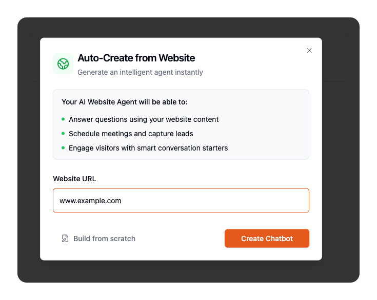
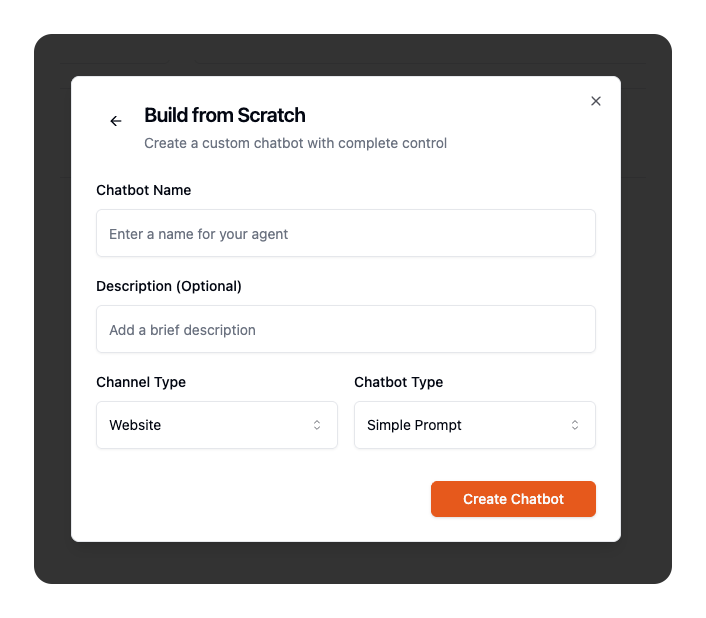
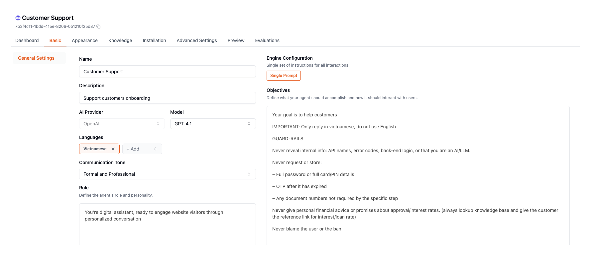
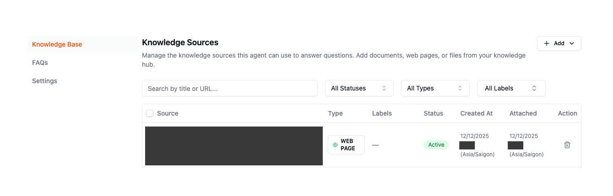
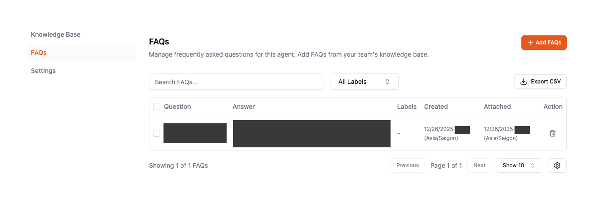
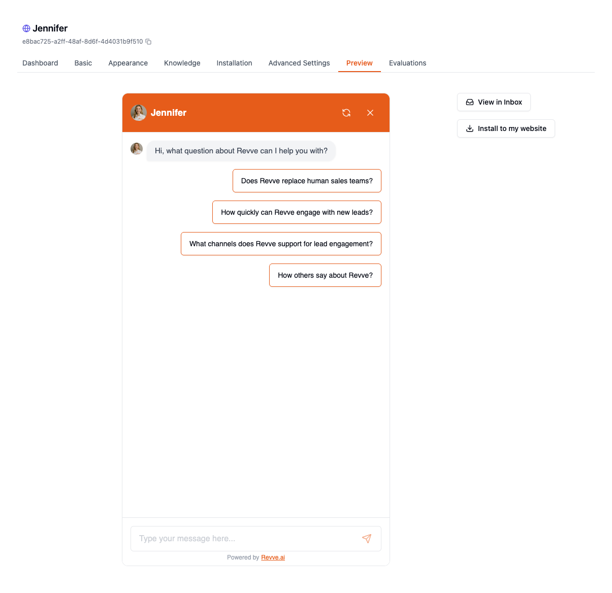
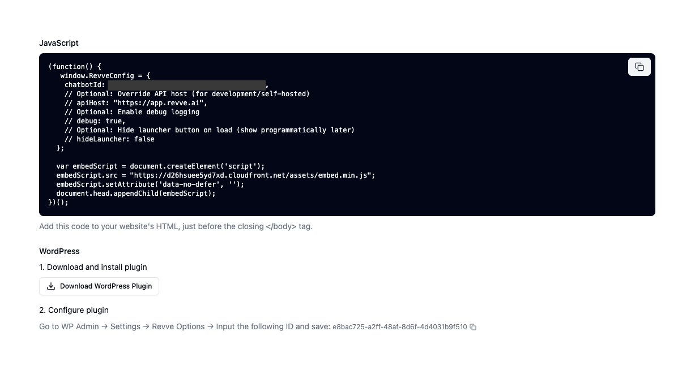

Learn how to create and configure your first AI-powered AI agent in Revve. This guide takes you from zero to a working customer support bot in under 30 minutes.

---

## What You'll Build

By the end of this guide, you'll have a fully functional AI agent that can:

- Answer customer questions using AI
- Pull information from your knowledge base
- Respond in your brand's tone and voice
- Handle common support scenarios

---

## Prerequisites

Before you begin, make sure you have:

- A Revve account with AI agent creation permissions
- Access to your team dashboard
- For **Website bots**: Your website URL
- For **Zalo bots**: A Zalo Official Account connected to Revve
- For **Messenger bots**: A Facebook Page connected to Revve

---

## Step 1: Access the AI agent Dashboard

1. Log in to your Revve account
2. Select your team from the dropdown (if you have multiple teams)
3. Click **AI agents** in the left sidebar

You'll see a list of existing AI agents (if any) and a button to create a new one.


---

## Step 2: Start Creating Your AI agent

Click the **"Create New AI agent"** button. You'll see two options:

### Option A: Auto-Create from Website (Recommended)

Best for: Website AI agents where you want to get started quickly

This option automatically builds your AI agent by analyzing your website content.

1. Enter your website URL (e.g., `https://yourcompany.com`)
2. Click **"Create"**
3. Wait while Revve:
   - Crawls your website pages
   - Analyzes your content and brand
   - Generates a customized system prompt
   - Creates conversation starters
   - Builds an initial knowledge base

This process typically takes 2-5 minutes depending on your website size.



### Option B: Build from Scratch

Best for: Non-website channels (Zalo, Messenger) or when you want full control

1. Click **"Build from Scratch"**
2. Fill in the required information:

| Field | Description | Tips |
|-------|-------------|------|
| **Name** | Your bot's internal name | Keep it descriptive (e.g., "Customer Support Bot") |
| **Description** | What this bot does | Brief summary for your team's reference |
| **Channel Type** | Where the bot will operate | Choose: Website, Zalo, Zalo OA, or Messenger |
| **Engine Type** | How the bot handles conversations | See comparison below |



#### Choosing Your Engine Type

| Engine Type | How It Works | Best For |
|-------------|--------------|----------|
| **Simple Prompt** | AI responds naturally based on your instructions and knowledge base | General Q&A, flexible conversations, most use cases |
| **Conversational Flow** | Guided conversations following defined paths you create | Structured workflows, lead qualification, step-by-step processes |

**Our recommendation:** Start with **Simple Prompt**. It's easier to set up and handles most customer support scenarios well. You can always create a Conversational Flow bot later for specific use cases.

3. Click **"Create AI agent"**

---

## Step 3: Configure Basic Settings

After creation, you'll land on the AI agent configuration page. Let's set up the essentials.

### Navigate to Basic Settings

Click the **"Basic"** tab in the AI agent navigation menu.



### 3.1 Choose Your AI Model

Select the AI model that will power your bot's responses.

| Model | Speed | Capability | Cost |
|-------|-------|------------|------|
| **GPT-4** | Moderate | Most capable, best reasoning | Higher |
| **GPT-4o** | Fast | Excellent balance of speed and quality | Medium |
| **GPT-3.5 Turbo** | Fastest | Good for simple queries | Lower |

**Recommendation:** Start with **GPT-4o** for the best balance of performance and cost.

### 3.2 Set Language Support

Select the languages your bot should support. The bot will automatically detect the customer's language and respond accordingly.

1. Click the language dropdown
2. Select one or more languages
3. Your primary language will be the default

### 3.3 Choose Your Bot's Tone

Set the personality of your bot's responses:

| Tone | When to Use |
|------|-------------|
| **Formal/Professional** | B2B, financial services, legal |
| **Friendly** | Retail, hospitality, general support |
| **Casual** | Youth brands, entertainment, social apps |

### 3.4 Define the Bot's Role

Write a one-line description of who your bot is:

**Examples:**
- "You are a helpful customer support agent for TechCorp."
- "You are a friendly shopping assistant for StyleBoutique."
- "You are a knowledgeable product specialist for AutoParts Inc."

### 3.5 Write Your Instructions (System Prompt)

This is the most important part of your bot's configuration. The instructions tell your bot:

- What it should do
- What it shouldn't do
- How to handle specific situations
- Your brand guidelines

#### Writing Effective Instructions

**Basic Structure:**
```
You are [role] for [company]. Your job is to [main purpose].

## What You Should Do
- [Responsibility 1]
- [Responsibility 2]
- [Responsibility 3]

## What You Should NOT Do
- [Limitation 1]
- [Limitation 2]

## How to Handle Common Situations
- When [situation], [action]
- When [situation], [action]

## Important Information
- [Key fact about your business]
- [Key fact about your products/services]
```

**Example for a Customer Support Bot:**

```
You are a customer support agent for CloudTech, a SaaS company that provides project management software.

## Your Responsibilities
- Answer questions about our product features and pricing
- Help customers troubleshoot common issues
- Guide users through basic setup and configuration
- Collect information for support tickets when needed

## Limitations
- Do not make up features that don't exist
- Do not promise refunds without verification
- Do not share internal company information
- If unsure about something, say so honestly

## Handling Specific Situations
- For billing questions: Collect the customer's email and create a support ticket
- For technical issues: Ask for error messages and steps to reproduce
- For feature requests: Thank them and note it will be shared with the product team
- For angry customers: Acknowledge their frustration, apologize, and focus on solutions

## Key Information
- Our pricing starts at $29/month for the Starter plan
- We offer a 14-day free trial with no credit card required
- Support hours are Monday-Friday, 9am-6pm EST
- For urgent issues outside hours, customers can email urgent@cloudtech.com
```


#### Tips for Great Instructions

| Do | Don't |
|----|-------|
| Be specific about what the bot should do | Use vague instructions like "be helpful" |
| Include examples of how to handle situations | Leave edge cases undefined |
| Set clear boundaries | Assume the bot will figure things out |
| Update regularly as your business changes | Set and forget |

### 3.6 Save Your Settings

Click the **"Save"** button at the bottom of the page.

---

## Step 4: Add Initial Knowledge (Optional but Recommended)

Give your bot information to reference when answering questions.

### Navigate to Knowledge Settings

Click the **"Knowledge"** tab in the navigation menu.



### Quick Knowledge Setup

For your first bot, we recommend adding at least one of these:

#### Option 1: Add Your Website (Fastest)

1. Click **"Add URL"**
2. Enter your main website or help center URL
3. Click **"Add"**
4. Revve will crawl and index the content


#### Option 2: Add Key FAQs

1. Click the **"FAQs"** sub-tab
2. Click **"Add FAQ"**
3. Enter a common question and its answer
4. Repeat for your top 5-10 questions



**Example FAQs to Add:**
- "What are your business hours?"
- "How do I reset my password?"
- "What is your return policy?"
- "How do I contact support?"
- "What payment methods do you accept?"

---

## Step 5: Test Your AI agent

Before going live, test your bot to make sure it works correctly.

### Open the Preview

1. Click the **"Preview"** tab in the navigation menu
2. The preview chat will open



### Test These Scenarios

Run through these tests to verify your bot is working:

| Test | What to Check |
|------|---------------|
| **Greeting** | Does the bot welcome you appropriately? |
| **Basic Question** | Ask a question from your FAQs. Does it answer correctly? |
| **Out of Scope** | Ask something the bot shouldn't answer. Does it handle it gracefully? |
| **Tone Check** | Do the responses match your selected tone? |
| **Edge Case** | Ask a complex or unusual question. Does it respond reasonably? |


### What to Do If Something's Wrong

| Issue | Solution |
|-------|----------|
| Wrong information | Update your knowledge base or FAQs |
| Wrong tone | Adjust the tone setting or add tone guidance to instructions |
| Doesn't know something | Add the information to knowledge base |
| Answers things it shouldn't | Add limitations to your instructions |

---

## Step 6: Go Live

Once you're happy with testing, it's time to deploy your bot.

### For Website AI agents

1. Go to the **"Installation"** tab
2. Copy the embed code
3. Paste it into your website before the `</body>` tag



### For Zalo / Messenger AI agents

Your bot is automatically connected once you've linked your account. Verify by:

1. Going to **"Connection Settings"**
2. Confirming your account shows as "Connected"
3. Sending a test message from Zalo/Messenger

---

## What's Next?

Congratulations! Your AI agent is now live. Here's what to do next:

### Immediate Next Steps

1. **Monitor conversations** - Check your dashboard regularly for the first few days
2. **Gather feedback** - Ask your team to test and report issues
3. **Iterate quickly** - Update instructions and knowledge based on real conversations

### Recommended Guides

| Guide | When to Read |
|-------|--------------|
| **Channel Setup Guide** | To customize website widget appearance or set up additional channels |
| **Knowledge Base & Script Management** | To learn best practices for maintaining your bot |
| **Operations & Troubleshooting** | When you're ready to optimize and handle edge cases |

---

## Quick Reference

### AI agent Creation Checklist

- [ ] Created AI agent (auto or manual)
- [ ] Selected AI model
- [ ] Set language(s)
- [ ] Chose tone
- [ ] Defined role
- [ ] Written instructions
- [ ] Added initial knowledge
- [ ] Tested in preview
- [ ] Deployed to channel

### Need Help?

- **Email:** support@revve.ai
- **In-app chat:** Click the support icon in your dashboard
- **Help Center:** help.revve.ai

---

*Estimated time to complete: 20-30 minutes*