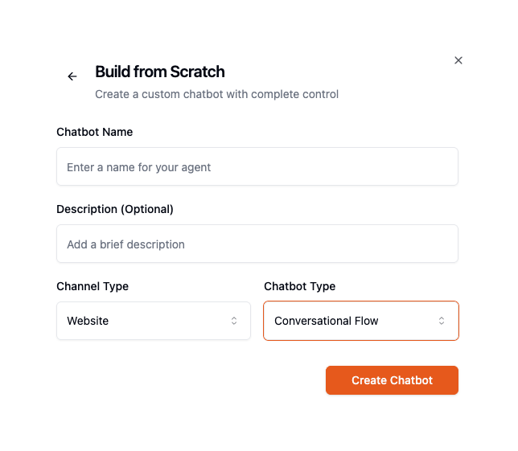
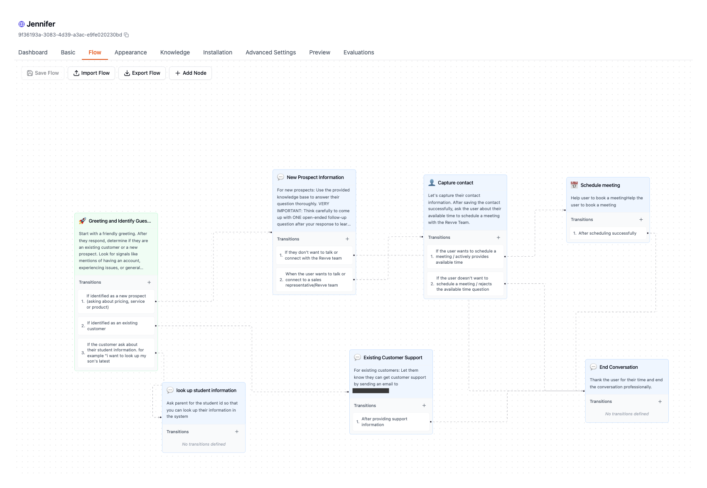
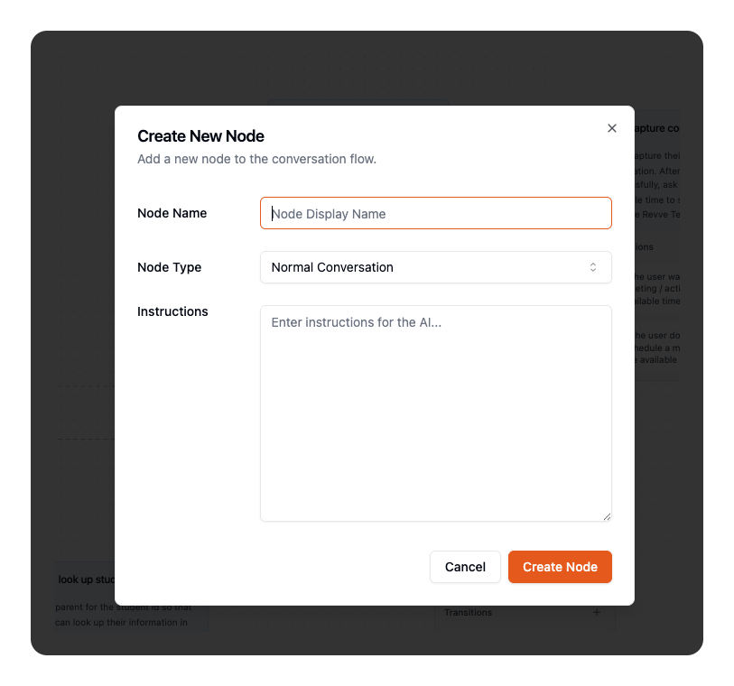
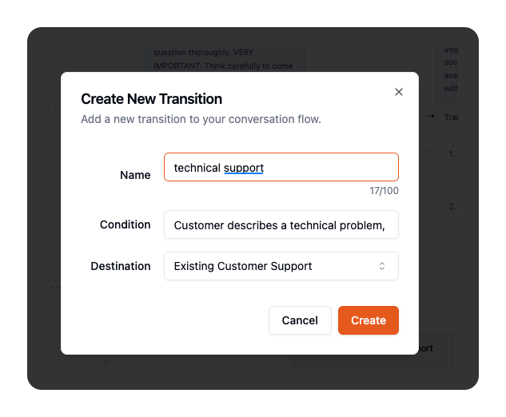
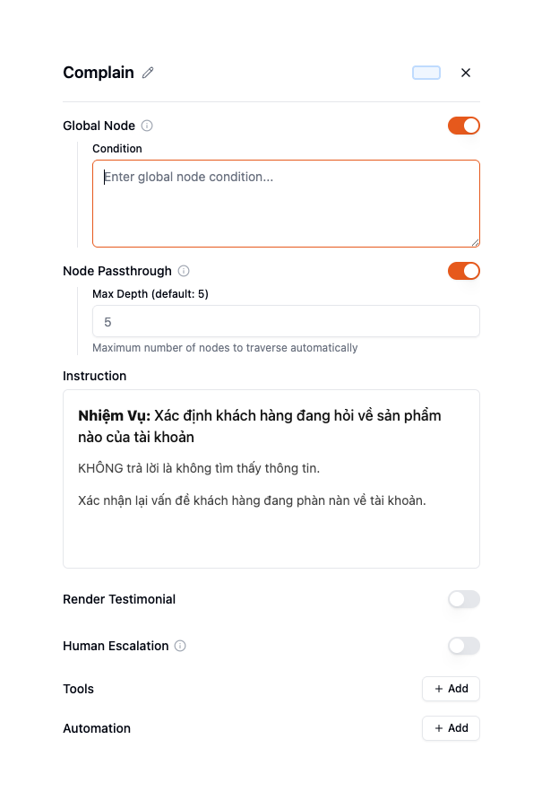
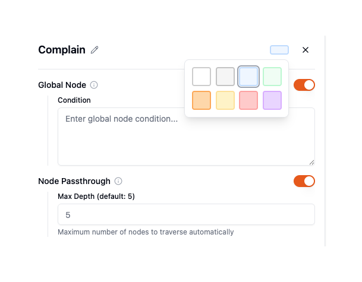
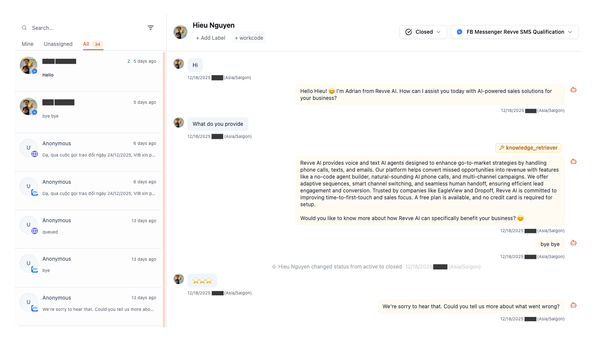

# Conversational Flow Chatbot Guide

## Build Multi-Step Customer Support Experiences with Visual Flow Builder

This guide teaches you how to create chatbots using Revve's Conversational Flow engine. Flow bots break complex conversations into distinct steps (nodes), where each step has its own dedicated prompt and set of tools. The AI automatically transitions between steps based on what the customer says.

---

## What You'll Build

By the end of this guide, you'll have a conversational flow chatbot that can:

- Break complex conversations into distinct, manageable steps
- Use different prompts and tools at each step
- Automatically transition between steps based on customer responses
- Collect information progressively through the conversation
- Handle multiple conversation paths with different outcomes

---

## How Conversational Flow Works

### Simple Prompt vs. Conversational Flow

| Simple Prompt | Conversational Flow |
|---------------|---------------------|
| One prompt handles the entire conversation | Multiple prompts, one per step |
| All tools available at all times | Different tools available at each step |
| AI decides everything from one instruction set | AI follows structured steps with focused instructions |
| Best for: General Q&A, simple support | Best for: Complex workflows, multi-step processes |

### The Flow Concept

Think of a flow as a map of your conversation:

```
┌─────────────────┐
│  Step 1:        │
│  Greeting &     │──── Customer asks about billing ────┐
│  Identify Need  │                                     │
└────────┬────────┘                                     ▼
         │                                    ┌─────────────────┐
         │ Customer asks                      │  Step 2A:       │
         │ about tech issue                   │  Billing        │
         ▼                                    │  Support        │
┌─────────────────┐                           │  (billing tools)│
│  Step 2B:       │                           └─────────────────┘
│  Technical      │
│  Troubleshooting│
│  (tech tools)   │
└─────────────────┘
```

**Each step (node) has:**
- **Its own prompt**: Focused instructions for that step
- **Its own tools**: Only the tools needed for that step
- **Transition conditions**: Rules for when to move to the next step

**The AI automatically:**
- Follows the current step's instructions
- Uses only the current step's tools
- Evaluates what the customer says
- Transitions to the appropriate next step

---

## When to Use Conversational Flow

| Use Case | Why Flow Works Best |
|----------|---------------------|
| **Multi-step troubleshooting** | Each step has focused diagnosis instructions |
| **Progressive information collection** | Collect different data at each step |
| **Different tools per stage** | Billing step gets billing tools, tech step gets tech tools |
| **Complex support workflows** | Break down into manageable, testable steps |
| **Guided processes** | Lead qualification, onboarding, order support |

**Use Simple Prompt instead when:**
- Conversations are unpredictable and open-ended
- You need all tools available at all times
- The same instructions work for all scenarios

---

## Prerequisites

Before you begin:

- A Revve account with chatbot creation permissions
- A clear idea of your conversation steps (sketch it out first)
- For Website bots: Your website URL for embedding
- For Zalo/Messenger: Connected accounts

---

## Part 1: Create Your Flow Chatbot

### Step 1: Start a New Chatbot

1. Go to **Chatbots** in your dashboard
2. Click **"Create New Chatbot"**
3. Select **"Build from Scratch"**

![Create New Chatbot]
`[SCREENSHOT: Create new chatbot button on the chatbot list page]`

### Step 2: Configure Creation Settings

Fill in the creation form:

| Field | Value | Notes |
|-------|-------|-------|
| **Name** | Your bot name | e.g., "Customer Support Flow" |
| **Description** | Brief purpose | e.g., "Multi-step product troubleshooting" |
| **Channel Type** | Website, Zalo, or Messenger | Choose your target channel |
| **Engine Type** | **Conversational Flow** | This enables the flow builder |



Click **"Create Chatbot"** to continue.

### Step 3: Complete Basic Configuration

Before building your flow, set up the basics:

1. Go to the **Basic** tab
2. Configure:
   - **AI Model**: GPT-4o recommended
   - **Language(s)**: Select supported languages
   - **Tone**: Match your brand voice
   - **Role**: Define who the bot is
   - **Instructions**: Write your global instructions (applies to all steps)
3. Click **Save**

**Note:** The global instructions in Basic settings apply to ALL nodes. Each node can then add its own specific instructions.

---

## Part 2: Understanding the Flow Builder

### Accessing the Flow Builder

Click the **"Flow"** tab in the navigation menu to open the visual editor.


### Flow Builder Interface



### Key Concepts

| Concept | Description |
|---------|-------------|
| **Node (Step)** | A distinct step in the conversation with its own prompt and tools |
| **Edge (Transition)** | A rule that moves the conversation from one node to another |
| **Start Node** | The first step customers enter (marked with 🚀) |
| **Global Node** | A step that can be triggered from ANY other step |
| **Current Node** | The step the customer is currently in (tracked per conversation) |

---

## Part 3: Building Your First Flow

Let's build a customer support flow with this structure:

```
Greeting → Identify Need
              │
    ┌─────────┼─────────┐
    ▼         ▼         ▼
 Billing   Technical   Escalate
 (billing  (tech       (escalation
  tools)    tools)      tools)
```

### Step 1: Configure the Start Node

Your flow starts with a default node. Let's configure it as the greeting step:

1. Click on the existing node in the canvas
2. In the Properties Panel, update:

**Name:** `Greeting & Identify Need`

**Instructions:**
```
Welcome the customer warmly. Your goal in this step is to understand what they need help with.

Ask how you can assist them today. Listen for:
- Billing/payment/invoice questions → transition to Billing Support
- Technical issues/bugs/errors → transition to Technical Support
- Requests to speak with a human → transition to Escalate

Keep this step brief. Once you understand their need, the conversation will automatically move to the appropriate step.
```

The node is automatically set as the Start Node (🚀).

![Edit Start Node]
`[SCREENSHOT: Properties panel showing the Greeting node being edited with name and instructions fields]`

### Step 2: Add the Billing Support Node

Click **"Add Node"** in the toolbar:

| Field | Value |
|-------|-------|
| **Name** | Billing Support |
| **Type** | Normal Conversation |
| **Instructions** | See below |

**Instructions for Billing Support:**
```
You are now helping with billing and account questions.

In this step, you can help with:
- Viewing invoice history
- Explaining charges
- Updating payment methods
- Processing refund requests (up to $50)

For refunds over $50, collect the customer's email and order number, then transition to escalation.

```



### Step 3: Add the Technical Support Node

Click **"Add Node"** again:

| Field | Value |
|-------|-------|
| **Name** | Technical Support |
| **Type** | Normal Conversation |
| **Instructions** | See below |

**Instructions for Technical Support:**
```
You are now helping with technical issues.

In this step:
1. Ask which product they're having trouble with
2. Ask them to describe the issue
3. Guide them through troubleshooting steps
4. Use the diagnostic tools available in this step

If the issue isn't resolved after 3 troubleshooting attempts, offer to escalate to a specialist.
```

### Step 4: Add the Escalate Node

Click **"Add Node"** one more time:

| Field | Value |
|-------|-------|
| **Name** | Escalate to Human |
| **Type** | Normal Conversation |
| **Instructions** | See below |

**Instructions for Escalate:**
```
The customer needs human assistance.

In this step:
1. Acknowledge their need for human support
2. Collect their name and email if not already provided
3. Let them know a team member will follow up within 24 hours
4. Use the escalation tool to create a support ticket

Thank them for their patience.
```

### Step 5: Create Transitions

Now connect the nodes with transition rules. The AI will evaluate these conditions to decide when to move between steps.

#### From Greeting to Technical Support

Add another transition:
- **Condition**: "Customer describes a technical problem, bug, error, or something not working"
- **Destination**: Technical Support



### Step 6: Save Your Flow

Click the **"Save"** button in the toolbar.

---

## Part 4: How Transitions Work

Understanding transitions is key to building effective flows.

### The AI Evaluates Conditions

When a customer sends a message, the AI:

1. **Reads the message** in context of the conversation
2. **Evaluates each transition condition** from the current node
3. **Selects the matching transition** (or stays on current node)
4. **Moves to the destination node** and uses that node's instructions

### Writing Good Conditions

Conditions are natural language descriptions of when to transition:

**Good conditions:**
```
"Customer asks about billing, payments, or invoices"
"Customer describes a technical problem or error"
"Customer confirms they want to proceed with the purchase"
"Issue is resolved and customer is satisfied"
"Customer explicitly asks to speak with a human"
```

**Avoid:**
```
"Customer says yes" (too vague - yes to what?)
"When appropriate" (not specific enough)
"Customer is angry" (hard to detect reliably)
```

### Transition Priority

If multiple conditions could match:

1. **Direct transitions** (from current node) are evaluated first
2. **Global transitions** (from global nodes) are evaluated second
3. First matching condition wins

### Staying on Current Node

The AI stays on the current node when:
- No transition conditions match
- The node has `do_not_transit` enabled
- The action is a form submission

![Transition Flow]
`[SCREENSHOT: Canvas showing transitions with arrows and condition labels visible]`

---

## Part 5: Assigning Tools to Nodes

Each node can have its own set of tools. This is a key advantage of Conversational Flow.

### Why Node-Specific Tools?

| Scenario | Benefit |
|----------|---------|
| Billing node has billing lookup tool | AI only tries to look up billing when in billing step |
| Tech node has diagnostic tool | Diagnostic tool only available during troubleshooting |
| Escalate node has ticket creation tool | Tickets only created at escalation step |

### Adding Tools to a Node

1. Select the node
2. In the Properties Panel, find the **Tools** section
3. Click **"Add Tool"**
4. Select from available tools

![Tool Selection]
`[SCREENSHOT: Properties panel showing Tools section with Add Tool button and tool dropdown]`

### Tool Availability Rules

| Tool Type | When Available |
|-----------|----------------|
| **Node-specific tools** | Only when in that node |
| **Global tools** | Available in all nodes |
| **Preset tools** | Based on node settings (contact collection, booking, etc.) |

---

## Part 6: Advanced Flow Features

### Global Nodes

A Global Node can be triggered from ANY node when its condition is met. Use this for:
- "Talk to human" requests from anywhere
- Help/FAQ access from any step
- Cancel/exit requests

#### Creating a Global Node

1. Create or select a node
2. Toggle **"Global Node"** ON
3. Set the **Global Condition**:
   ```
   Customer explicitly asks to speak with a human, says "help", "agent", or "representative"
   ```



**How it works:** When a customer says "I want to talk to a human" from ANY node, the AI evaluates the global condition and can jump directly to the global node.

### Passthrough Nodes

Passthrough allows the AI to automatically skip through a node if its requirements are already satisfied.

**Use case:** Skip the "collect email" node if the customer already provided their email.

1. Select the node
2. Toggle **"Passthrough Eligible"** ON
3. Set **Max Passthrough Depth** (default: 5)

**How it works:** The AI checks if the node's purpose is already fulfilled. If yes, it automatically moves to the next node without generating a response.

### Lock a Node (Do Not Transit)

Prevent the AI from leaving a node until a specific action completes:

1. Select the node
2. Enable **"Do Not Transit"**

**Use case:** Keep customer in the payment node until payment is confirmed.

### Node Colors

Color-code nodes to organize your flow visually:

1. Select a node
2. Click the color picker
3. Choose from 8 colors

**Suggested scheme:**
- Blue: Main conversation path
- Green: Success/completion nodes
- Orange: Information collection
- Red: Escalation nodes
- Purple: Special actions



---

## Part 7: Node Instructions Best Practices

### Structure for Node Instructions

Each node's instructions should clearly define:

```
1. CONTEXT: What step is this? What just happened?
2. GOAL: What should be accomplished in this step?
3. ACTIONS: What should the bot do or ask?
4. TOOLS: When to use available tools
5. TRANSITIONS: What signals moving to next step?
```

### Example: Well-Written Node Instructions

**Node: Product Selection**
```
## Context
The customer has indicated they want to make a purchase. You are now helping them choose a product.

## Goal
Help the customer find the right product for their needs.

## What to Do
1. Ask what type of product they're looking for
2. Present 2-3 options that match their needs
3. Answer questions about features, pricing, and availability
4. Use the product_search tool to find matching products

## Available Tools
- product_search: Search product catalog
- get_product_details: Get full product information

## When to Transition
- Customer selects a product → move to Checkout
- Customer wants to speak to sales → move to Escalate
- Customer decides not to purchase → move to Goodbye
```

### Common Mistakes

| Mistake | Why It's a Problem | Fix |
|---------|-------------------|-----|
| Instructions too vague | AI doesn't know what to do | Be specific about actions |
| No tool guidance | AI uses tools incorrectly | Explain when to use each tool |
| Missing transition signals | AI doesn't know when to move on | Define what triggers transitions |
| Duplicating global instructions | Cluttered, conflicting info | Only add node-specific details |

---

## Part 8: Testing Your Flow

### Preview Mode

1. Go to the **Preview** tab
2. Start a conversation
3. Test each path through your flow

### What to Test

| Test | What to Check |
|------|---------------|
| **Start** | Does the greeting step work correctly? |
| **Each transition** | Do conditions trigger the right moves? |
| **Node instructions** | Does each step respond appropriately? |
| **Tools per node** | Are the right tools available at each step? |
| **Global nodes** | Can you trigger them from any step? |
| **Edge cases** | What happens with unexpected inputs? |

### Testing Checklist

- [ ] Start node greets correctly
- [ ] Each transition triggers on intended conditions
- [ ] Node-specific tools work in their nodes
- [ ] Tools are NOT available in wrong nodes
- [ ] Global node triggers from multiple steps
- [ ] Conversation flows to completion
- [ ] Escalation path works

### Debugging Tips

**Wrong node transition:**
- Check transition conditions for overlaps
- Make conditions more specific
- Review the condition evaluation order

**Tools not working:**
- Verify tool is assigned to the node
- Check if tool is enabled (not just added)
- Confirm tool settings are correct

**Bot stuck on a node:**
- Add a fallback transition condition
- Check if "Do Not Transit" is accidentally enabled
- Ensure at least one transition condition can match

---

## Part 9: Day-to-Day Operations

### Updating Node Instructions

1. Go to **Flow** tab
2. Click the node to edit
3. Update the **Instructions**
4. Click **Save**


### Adding a New Step

1. Click **"Add Node"**
2. Configure the node with name, type, and instructions
3. Create transitions TO the new node from existing nodes
4. Create transitions FROM the new node to next steps
5. Assign appropriate tools
6. Save the flow

### Reorganizing the Flow

- Drag nodes to rearrange visually (doesn't affect logic)
- Update transitions to change conversation paths
- Use colors to maintain visual organization

### Monitoring Conversations

1. Go to **Dashboard**
2. Go to Inbox 
3. Select `All` to view all realtime converations 
4. Select a conversation
3. Watch for:
   - Which nodes customers spend time in
   - Where customers get stuck
   - Common transition patterns
4. Refine flow based on patterns



---

## Part 10: Import & Export

### Exporting a Flow

Backup or share your flow:

1. Click **"Export"** in the toolbar
2. JSON file downloads automatically

### Importing a Flow

Load a previously exported flow:

1. Click **"Import"** in the toolbar
2. Select the JSON file
3. Flow replaces your current flow

**Warning:** Import overwrites your current flow. Export first as backup.

---

## Quick Reference

### Node Icons

| Icon | Meaning |
|------|---------|
| 🚀 | Start Node |
| 💬 | Normal Conversation |
| 👤 | Contact Collection |
| 📅 | Schedule Meeting |

### Keyboard Shortcuts

| Shortcut | Action |
|----------|--------|
| `Cmd/Ctrl + S` | Save flow |
| `Delete/Backspace` | Delete selected element |
| `Escape` | Deselect / Close panel |

### Flow Limits

| Limit | Recommendation |
|-------|----------------|
| Nodes | 10-15 for maintainability |
| Transitions per node | 3-5 for clarity |
| Passthrough depth | Default 5, max 10 |

---

## Troubleshooting

### "Conversation stuck on one node"

- Check that transition conditions are specific enough
- Verify transitions exist FROM this node
- Check if "Do Not Transit" is enabled

### "Wrong node gets activated"

- Transition conditions may overlap
- Make conditions mutually exclusive
- Direct transitions take priority over global

### "Tools not appearing"

- Confirm tool is assigned to the node (check tool_ids)
- Verify tool is enabled, not just added
- Check if it's a global tool vs node-specific

### "Flow won't save"

- Ensure a Start Node is set
- Check for validation errors
- Verify all transitions have valid destinations

---

## What's Next?

| Guide | When to Read |
|-------|--------------|
| **Channel Setup Guide** | To customize widget or add channels |
| **Knowledge Base & Script Management** | To add FAQs and knowledge |
| **Mobile App Integration** | To embed in Android/iOS apps |

---

## Need Help?

- **Email:** support@revve.ai
- **In-app chat:** Click the support icon
- **Help Center:** help.revve.ai

---

*Estimated time to complete: 45-60 minutes for your first flow*
