## Keep Your Chatbot Smart and Up-to-Date

This guide covers the day-to-day operations of managing your chatbot's knowledge and instructions. Learn how to build your team's knowledge library, attach knowledge to specific bots, and keep your content accurate.

---

## What You'll Learn

By the end of this guide, you'll know how to:

- Build your team's shared knowledge library
- Set up web crawlers to index entire websites
- Upload documents and import FAQs in bulk
- View and manage indexed content
- Attach knowledge to specific chatbots
- Update your bot's instructions and scripts
- Configure search settings for better accuracy

---

## Part 1: Understanding Knowledge in Revve

### Two Levels of Knowledge

Revve uses a **two-level system** for managing knowledge:

```
┌─────────────────────────────────────────────────────────────┐
│                    TEAM KNOWLEDGE LIBRARY                   │
│              (Shared Pool - Index Once, Use Many)           │
│                                                             │
│   ┌──────────┐   ┌──────────┐   ┌──────────┐   ┌─────────┐  │
│   │ Web Pages│   │Documents │   │ Crawlers │   │  FAQs   │  │
│   └──────────┘   └──────────┘   └──────────┘   └─────────┘  │
└─────────────────────────────────────────────────────────────┘
                            │
            ┌───────────────┼───────────────┐
            ▼               ▼               ▼
     ┌────────────┐  ┌────────────┐  ┌────────────┐
     │  Bot A     │  │  Bot B     │  │  Bot C     │
     │  Attached: │  │  Attached: │  │  Attached: │
     │  - FAQ 1,2 │  │  - FAQ 1,3 │  │  - All     │
     │  - Doc A   │  │  - Doc B   │  │  - Docs    │
     └────────────┘  └────────────┘  └────────────┘
```

| Level | Location | Purpose |
|-------|----------|---------|
| **Team Knowledge** | Dashboard sidebar → Knowledge Base / FAQs | Shared library for all bots |
| **Bot Knowledge** | Chatbot → Knowledge tab | What's attached to this specific bot |

### Why Two Levels?

- **Efficiency**: Index content once, use in multiple bots
- **Flexibility**: Each bot can use different subsets
- **Organization**: Keep your team library clean and organized
- **Reusability**: Update once, changes reflect everywhere

---

## Part 2: Building Your Team Knowledge Library

### Accessing Team Knowledge

From your dashboard sidebar, you'll find:

- **Knowledge Base**: Web pages and documents
- **FAQs**: Question-answer pairs
- **Crawlers**: Automated website indexing

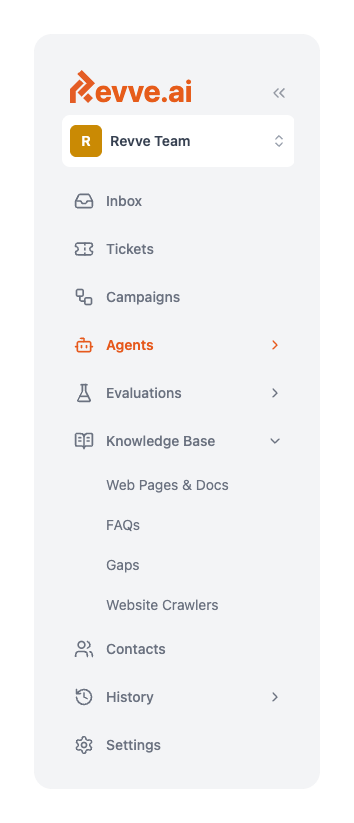

---

### Setting Up Web Crawlers

Crawlers automatically index content from websites. Use them to:
- Index your entire help center
- Keep documentation up-to-date
- Capture product pages

#### Creating a New Crawler

1. Go to **Crawlers** in the sidebar
2. Click **"New Crawler"**

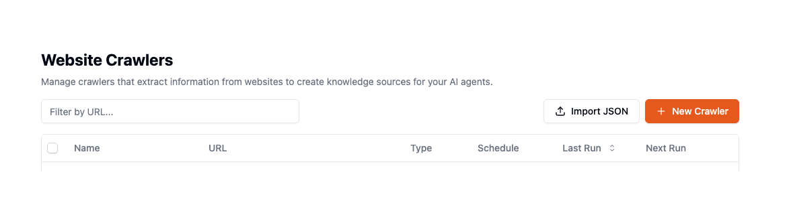

#### Step 1: URL & Crawl Type

Choose how much to crawl:

| Type | What It Does | Best For |
|------|--------------|----------|
| **Scrape** | Index a single page | Individual articles, specific pages |
| **Crawl** | Index entire site (follows links) | Help centers, documentation sites |

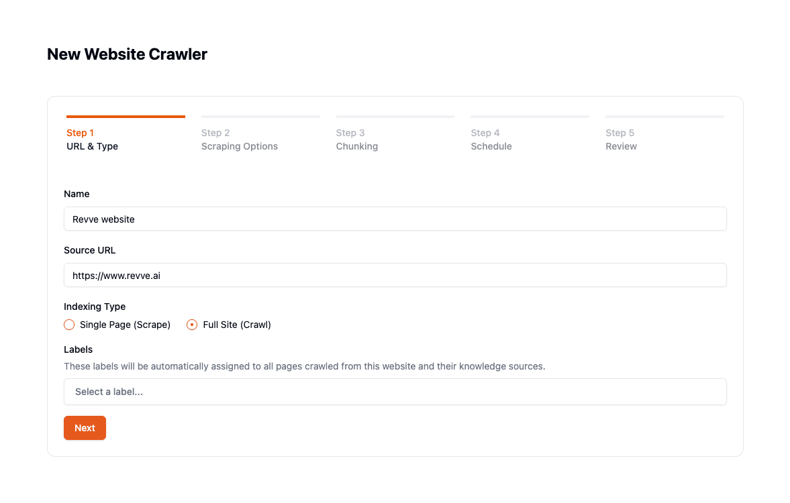

#### Step 2: Scraping Options

Configure how content is extracted:

| Option | Description |
|--------|-------------|
| **Format** | Markdown (recommended), HTML, or plain text |
| **Only main content** | Skip headers, footers, sidebars |
| **Block ads** | Remove advertisement content |
| **Remove base64 images** | Skip embedded images |
| **Wait time** | Milliseconds to wait for page load |

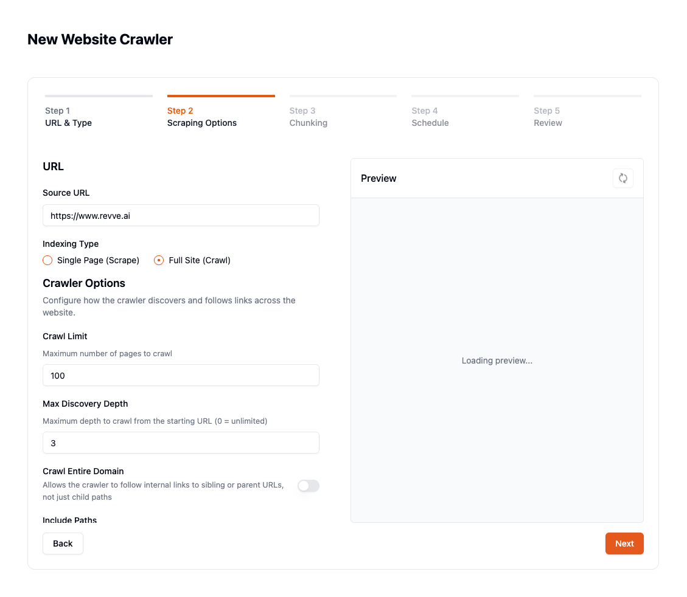

#### Step 3: Crawling Options (for Crawl type)

Configure link following behavior:

| Option | Description |
|--------|-------------|
| **Max discovery depth** | How many levels of links to follow (e.g., 3) |
| **Crawl entire domain** | Follow all links on the domain |
| **Include paths** | Only crawl URLs matching these patterns |
| **Exclude paths** | Skip URLs matching these patterns |

**Example include/exclude:**
```
Include: /help/*, /docs/*
Exclude: /blog/*, /news/*, authenticated pages
```


#### Step 4: Chunking & Preview

Preview how content will be split:

- Adjust **chunk size** (default: 5000 characters)
- Adjust **chunk overlap** (default: 500 characters)
- Preview the extracted content

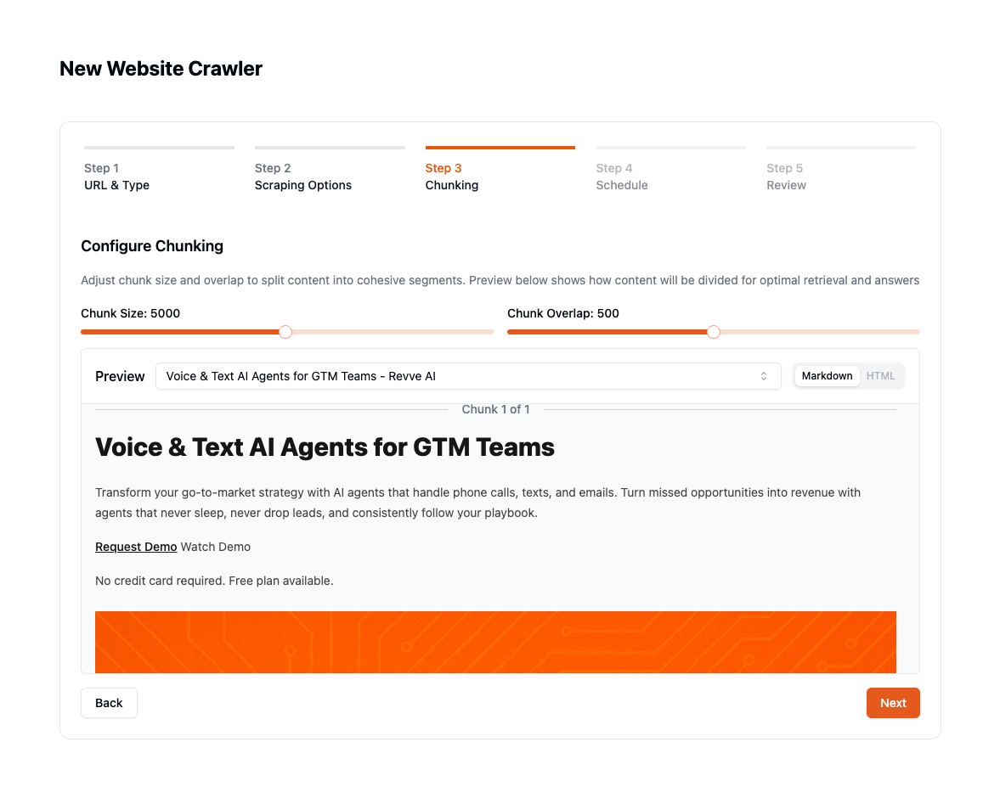
#### Step 5: Schedule

There are two reindexing schedules: for discovered pages & a full crawler run.

| Schedule | Use Case |
|----------|----------|
| **None** | One-time crawl |
| **Daily** | Frequently updated content |
| **Weekly** | Stable documentation |

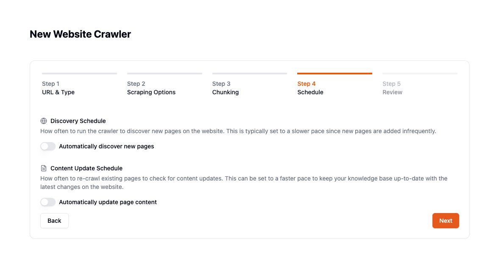

#### Step 6: Review & Create

Review all settings and click **"Create Crawler"**.

The crawler will start immediately and run in the background.

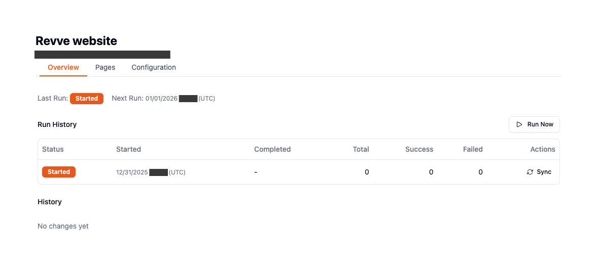

---

### Uploading Documents

Add PDFs, Word documents, and text files to your knowledge library.

#### How to Upload

1. Go to **Knowledge Base** in the sidebar
2. Click **"Add"** → **"Upload Documents"**
3. Drag and drop files (or click to browse)
4. Optionally select **labels** for organization
5. Click **"Upload"**

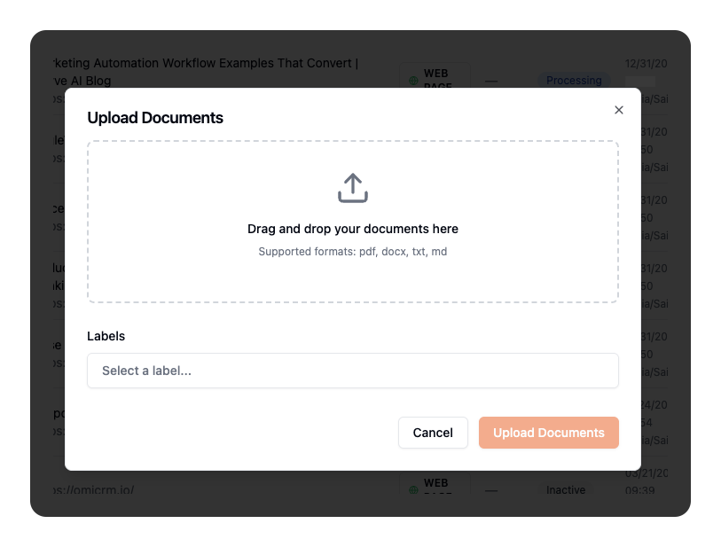

#### Supported Formats

| Format | File Types |
|--------|------------|
| **PDF** | Product manuals, policies, brochures |
| **DOCX** | Word documents |
| **TXT** | Plain text files |
| **MD** | Markdown files |

#### What Happens After Upload

1. File stored securely in cloud storage
2. Text extracted (OCR for PDFs)
3. Content split into searchable chunks
4. AI generates summary
5. Status changes to **"Processed"**

---

### Importing FAQs

FAQs provide quick, accurate answers to common questions.

#### Creating Individual FAQs

1. Go to **FAQs** in the sidebar
2. Click **"Add FAQ"**
3. Enter the **Question**
4. Enter the **Answer**
5. Optionally add **Labels** and attach to existing agents
6. Click **"Save"**

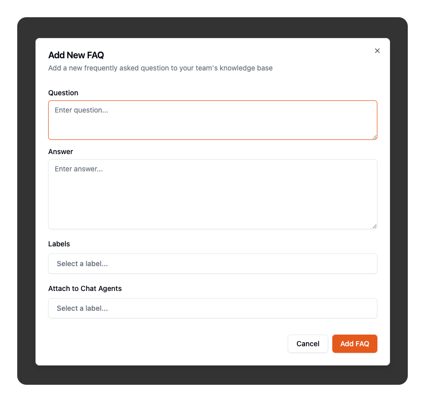

#### Bulk Import from Spreadsheet

For large FAQ sets:

**Step 1: Prepare Your File**

| Format | Structure |
|--------|-----------|
| **CSV** | Two columns: Question, Answer |
| **TXT** | Two columns: Question, Answer |
| **Excel** | Any columns (you'll map them) |

**Example CSV:**
```csv
question,answer
"What are your hours?","Monday-Friday, 9am-6pm EST"
"Do you offer free shipping?","Free shipping on orders over $50"
```

**Step 2: Upload**

1. Go to **FAQs**
2. Click **"Import FAQs"**
3. Drag and drop your file

**Step 3: Map Columns (Excel only)**

For Excel files:
1. Select the **Sheet**
2. Choose the **Question column**
3. Choose the **Answer column**
4. Set **Skip rows** if you have headers

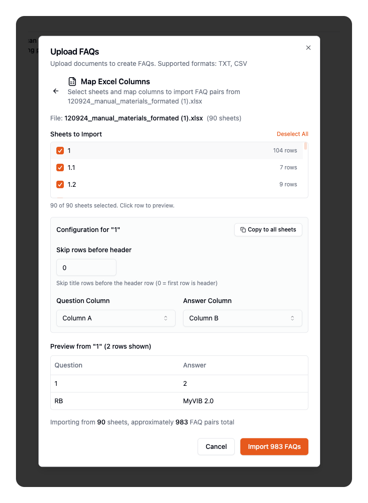

**Step 4: Add Labels (Optional)**

Select labels to apply to all imported FAQs.

**Step 5: Import**

Click **"Import"** and watch the progress:

---

### Viewing Indexed Content

See everything in your team's knowledge library.

#### Knowledge Base View

Go to **Knowledge Base** to see all web pages and documents:

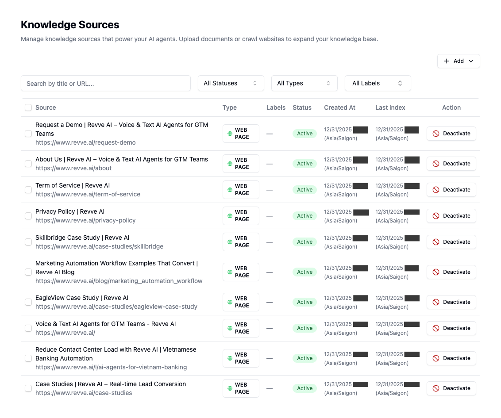

**Table Columns:**

| Column | Description |
|--------|-------------|
| **Type** | Icon showing: web page, PDF, DOCX, TXT, MD |
| **Title** | Name of the content |
| **URL** | Source URL or file location |
| **Status** | Processed, Pending, Inactive, Failed |
| **Last Indexed** | When content was last updated |
| **Labels** | Organization tags |

**Filtering Options:**

- **Search**: Find by title or URL
- **Status**: All, Processed, Inactive, Pending
- **Type**: All, Web Page, PDF, DOCX, TXT, MD
- **Label**: Filter by specific label

#### Viewing Item Details

Click any item to see full details:

- Complete metadata
- Full URL (clickable)
- Associated labels
- Which bots it's attached to
- Last indexed timestamp

![Knowledge Details Sidebar(img_31.png)

#### FAQs View

Go to **FAQs** to see all question-answer pairs:

![FAQs List]
`[SCREENSHOT: FAQs table showing questions, answers, labels, dates]`

---

### Organizing with Labels

Labels help you organize and filter your knowledge.

#### Creating Labels

1. When uploading content, click **"Create new label"**
2. Enter the label name
3. Labels are color-coded automatically

#### Using Labels

- Filter knowledge base by label
- Filter FAQs by label
- Bulk attach by label (attach all items with a specific label)

---

## Part 3: Attaching Knowledge to Chatbots

Once you have content in your team library, attach it to specific bots.

### Accessing Bot Knowledge Settings

1. Go to your chatbot
2. Click the **"Knowledge"** tab

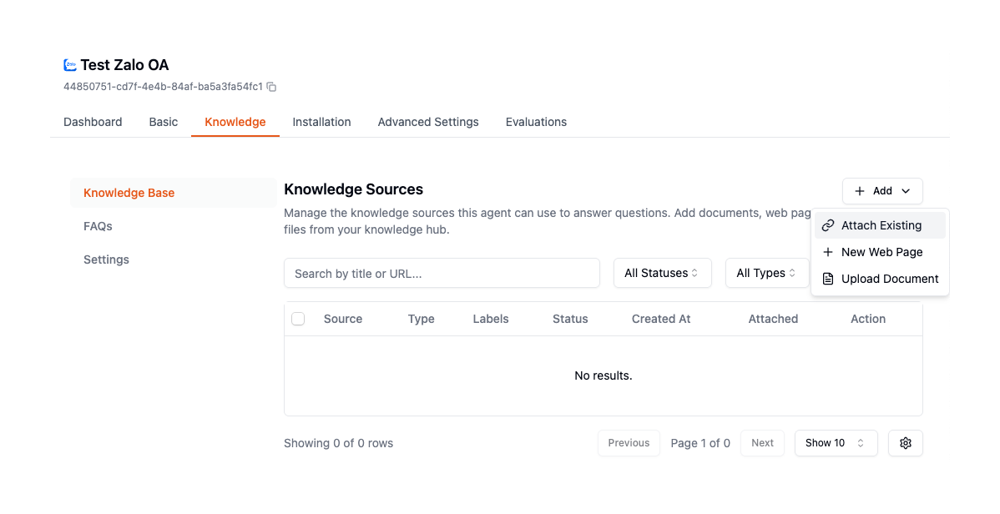

### Attaching Existing Knowledge

#### Method 1: Filter and Bulk Attach

1. Click **"Attach Existing"**
2. Use filters to find content:
   - **Search** by title/URL
   - **Filter by Label** to see only labeled items
   - **Filter by Type** (web page, PDF, etc.)
3. Click **"Select All Matching"** to select everything matching your filters
4. Click **"Attach Selected (N)"**

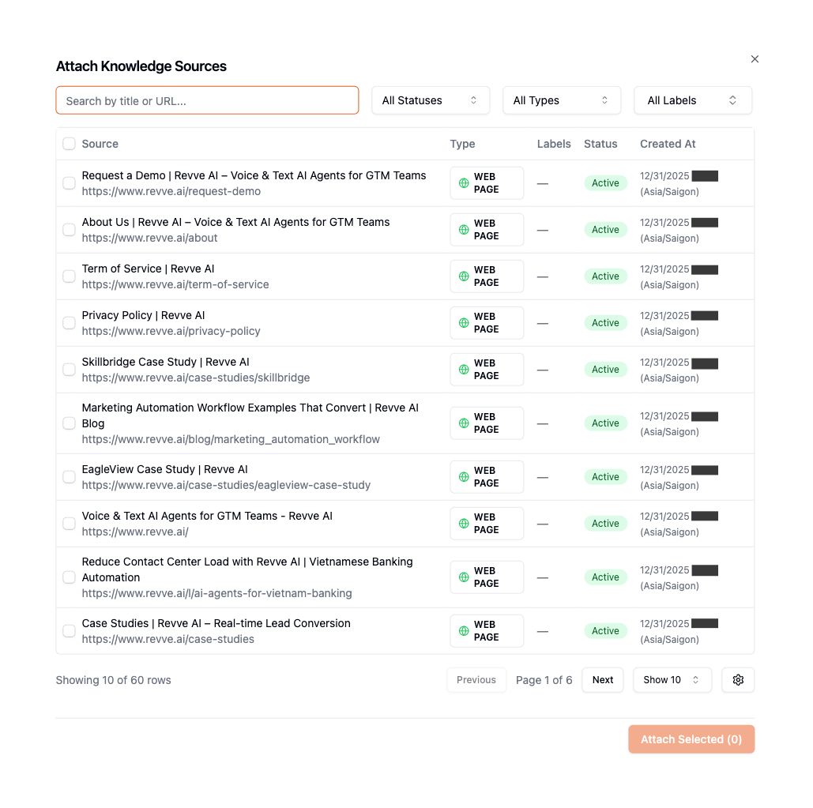

**Example: Attach all "Product" labeled content**
1. Open Attach Existing dialog
2. Select "Product" from Label dropdown
3. Click "Select All Matching" (shows count)
4. Click "Attach Selected"

#### Method 2: Individual Selection

1. Click **"Attach Existing"**
2. Browse or search for specific items
3. Check the boxes next to items you want
4. Click **"Attach Selected"**

### Viewing Attached Knowledge

Your bot's Knowledge tab shows:
- All attached web pages and documents
- All attached FAQs
- Attachment dates

### Removing Attached Knowledge

1. Select items to remove (checkboxes)
2. Click **"Remove Selected"**
3. Confirm removal

**Note:** Removing only detaches from this bot—content remains in your team library.

---

## Part 4: Managing FAQs at Bot Level

### Attaching FAQs

1. Go to bot **Knowledge** tab
2. Click **"FAQs"** sub-tab
3. Click **"Attach FAQs"**
4. Filter and select FAQs
5. Click **"Attach Selected"**

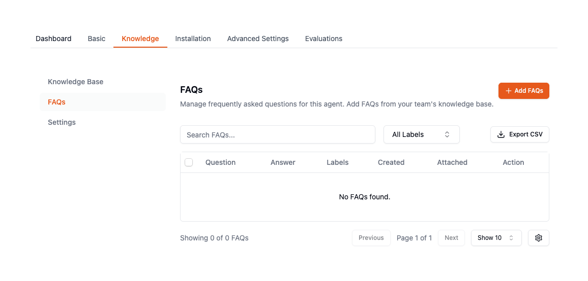

### FAQ Priority

FAQs are searched **before** the general knowledge base, making them ideal for:
- Your most common questions
- Questions needing exact answers
- Time-sensitive information

## Part 5: RAG Settings (Search Configuration)

RAG settings control how your bot searches the knowledge base.

### Accessing Settings

1. Go to bot **Knowledge** tab
2. Click **"Settings"** sub-tab

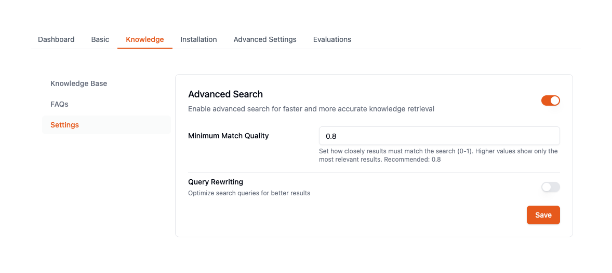

### Configuration Options

| Setting | Description | Recommended |
|---------|-------------|-------------|
| **Enable Advanced Search** | Use semantic matching | ON |
| **Threshold** | Match quality (0-1) | 0.8 |
| **Query Rewrite** | Optimize search queries | ON for complex topics |

**Threshold Guide:**
- **0.9-1.0**: Very strict, only highly relevant
- **0.7-0.8**: Balanced (recommended)
- **0.5-0.6**: Lenient, more results

---

## Part 7: Day-to-Day Maintenance

### When to Update

| Trigger | What to Update |
|---------|----------------|
| New product/service | Add to knowledge base |
| Policy change | Update documents, FAQs |
| Price change | Update FAQs |
| Common confusion | Add clarifying FAQs |
| Website update | Re-run crawler |

### Weekly Checklist

- [ ] Review recent conversations for gaps
- [ ] Add FAQs for repeated questions
- [ ] Check if any content is outdated
- [ ] Verify crawler status (if using scheduled crawls)

### Monthly Checklist

- [ ] Audit knowledge base for stale content
- [ ] Review and update instructions
- [ ] Remove obsolete documents
- [ ] Export FAQs for backup

---

## Part 8: Best Practices

### Team Knowledge

| Do | Don't |
|----|-------|
| Organize with labels | Leave everything unlabeled |
| Set up crawlers for dynamic content | Manually add pages that change often |
| Remove outdated content | Let old docs accumulate |
| Use descriptive titles | Use generic names like "Document1" |

### Bot Attachments

| Do | Don't |
|----|-------|
| Attach only relevant content | Attach everything "just in case" |
| Use labels for bulk operations | Manually attach hundreds of items |
| Review attachments periodically | Set and forget |

### FAQs

| Do | Don't |
|----|-------|
| Write questions as customers ask | Use internal jargon |
| Include variations | Expect exact matches |
| Keep answers concise | Write essay-length responses |
| Update when info changes | Let FAQs become stale |

---

## Troubleshooting

### "Bot can't find information I added"

| Cause | Solution |
|-------|----------|
| Content still processing | Wait for "Processed" status |
| Not attached to bot | Attach via bot's Knowledge tab |
| Threshold too high | Lower RAG threshold |
| Content not indexed | Check for "Failed" status, re-upload |

### "Crawler not finding pages"

| Cause | Solution |
|-------|----------|
| Exclude paths too broad | Review exclude patterns |
| Max depth too low | Increase discovery depth |
| Pages require login | Crawlers can't access authenticated content |

### "FAQs not matching"

| Cause | Solution |
|-------|----------|
| Question phrasing too specific | Add variations |
| FAQ not attached to bot | Attach via bot's Knowledge tab |
| Import failed | Check import job status |

---

## Quick Reference

### Supported File Formats

| Type | Formats |
|------|---------|
| **Documents** | PDF, DOCX, TXT, MD |
| **Spreadsheets** | CSV, XLSX, XLS (for FAQ import) |
| **Web** | Any public URL |

### Key Locations

| What | Where |
|------|-------|
| Team knowledge | Dashboard → Knowledge Base |
| Team FAQs | Dashboard → FAQs |
| Crawlers | Dashboard → Crawlers |
| Bot knowledge | Chatbot → Knowledge tab |
| Instructions | Chatbot → Basic tab |

---

## What's Next?

| Guide | When to Read |
|-------|--------------|
| **Channel Setup Guide** | To customize widget or add channels |
| **Mobile App Integration** | To embed in Android/iOS apps |

---

## Need Help?

- **Email:** support@revve.ai
- **In-app chat:** Click the support icon
- **Help Center:** help.revve.ai

---

*Keep your knowledge fresh—your bot is only as good as its information!*
