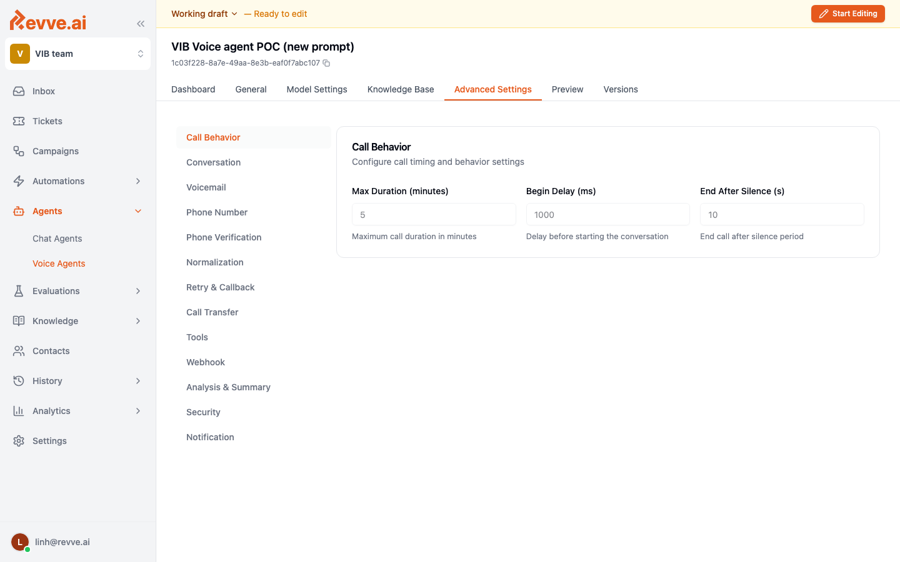
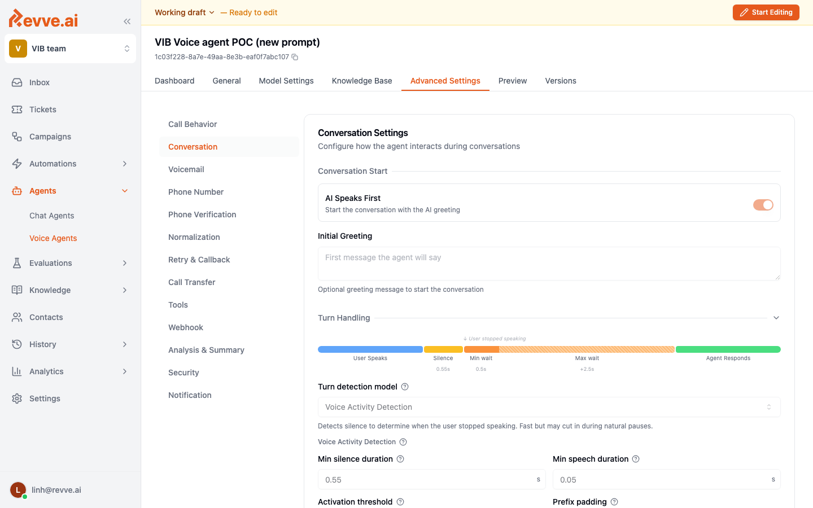
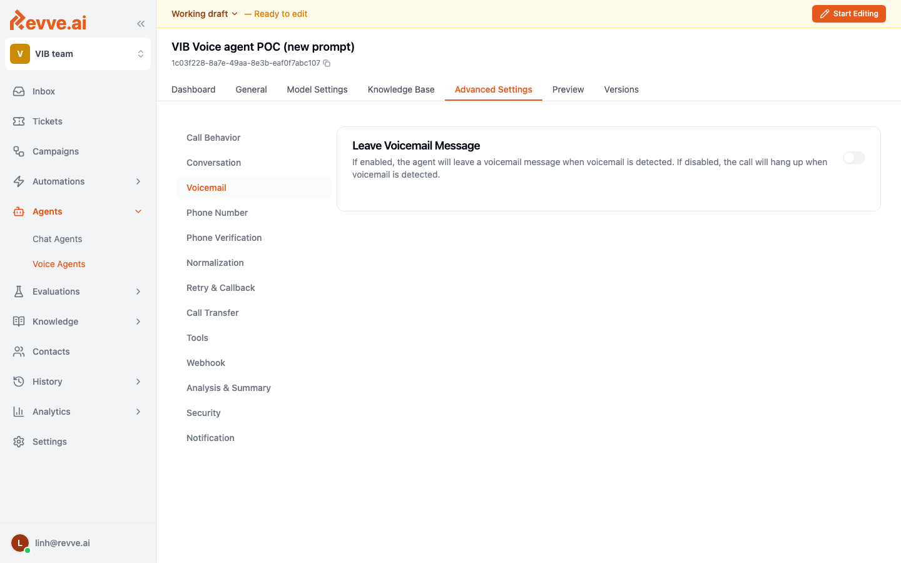
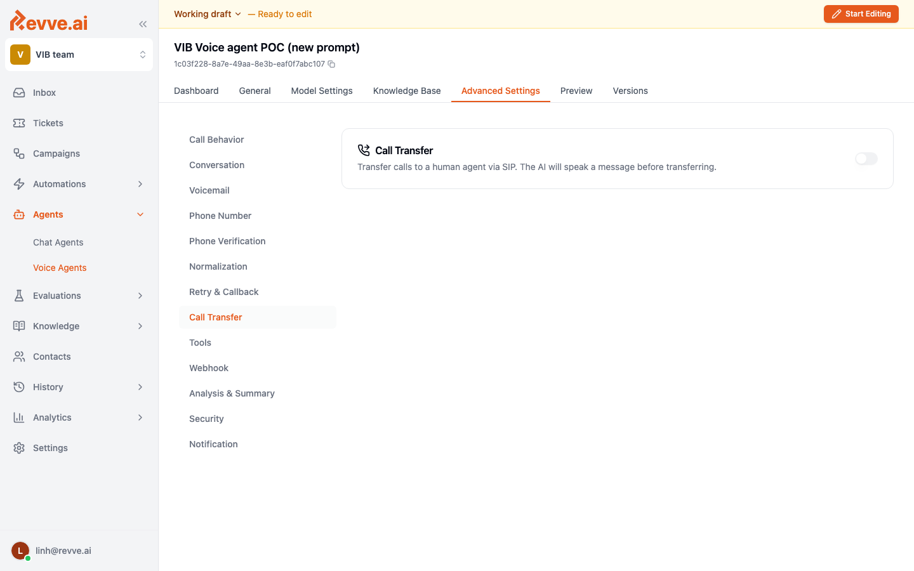
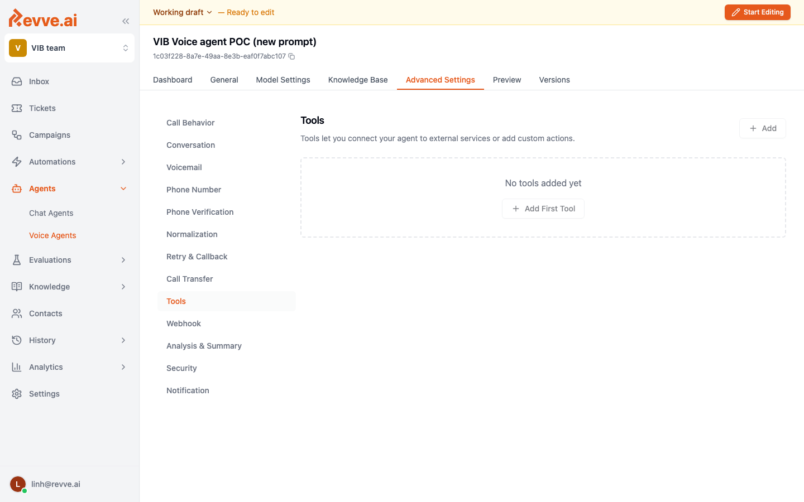
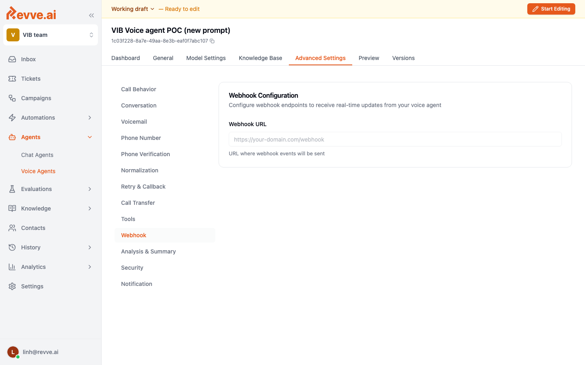
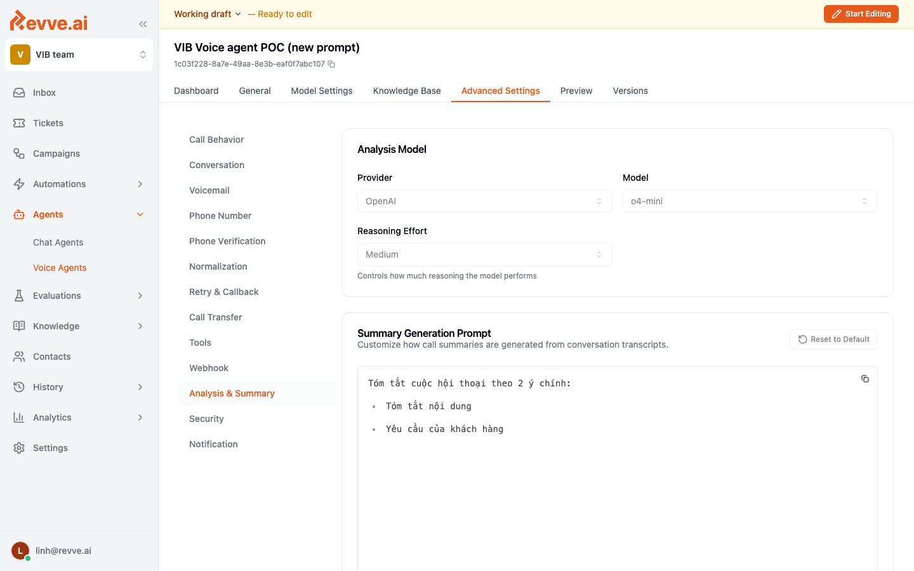

# Advanced Settings

The **Advanced Settings** tab is where production-grade tuning happens. Out-of-the-box defaults are sensible, but every real deployment ends up adjusting several of these sub-tabs to match their telephony carrier, customer base, and compliance rules.

Advanced Settings is divided into thirteen sub-tabs. Here's what each one controls.

## Call Behavior

The timing basics of every call.

| Field | Purpose | Typical value |
|-------|---------|---------------|
| **Max Duration (minutes)** | Hard cut-off for any single call. | 5–10 minutes |
| **Begin Delay (ms)** | Silence before the agent speaks the first word. Avoids clipped greetings. | `800–1200` ms |
| **End After Silence (s)** | End the call if the caller says nothing for this long. | `8–12` s |

## Conversation

Controls the rhythm and feel of the dialogue.

- **AI Speaks First** — the agent opens the call with the greeting. Turn this off for inbound IVR replacements where the caller speaks first.
- **Interruption Sensitivity** — how quickly the agent yields when the caller barges in. Higher = more yielding (more natural, but can cut the agent off mid-word). `0.5–0.7` is a good range.
- **Enable Backchannel** — short "uh huh" / "vâng ạ" cues while the caller speaks. Feels more human but adds audio.
- **Follow Up If Silence** — if the caller goes quiet, the agent gently nudges them ("Anh/chị vẫn ở đây không ạ?"). Set **Max Silence Follow-up Attempts** to 1 or 2.

## Voicemail

What happens when an answering machine picks up.

- **Detect Voicemail** — enable automatic answering-machine detection.
- **Voicemail Action** — hang up, or leave a pre-recorded / TTS message.
- **Voicemail Message** — the script to leave. Keep it under 15 seconds.

## Phone Number

Pick which phone numbers this agent listens on (inbound) and dials from (outbound). The numbers available here are provisioned at the workspace level.

## Phone Verification

OTP / phone verification tool settings. Used when the agent needs to confirm the caller's identity against your system of record.

## Normalization

Post-processing for transcripts and extracted values: trim whitespace, normalize diacritics, parse numeric fields, apply custom regex clean-up.

## Retry & Callback

Rules for retrying calls that don't connect or are rejected.

- **Retry attempts** — how many times to redial.
- **Retry intervals** — minutes between attempts.
- **Callback window** — time-of-day allowed to call (e.g., 9:00–18:00 local time).

Compliance tip: configure callback windows to match your local telemarketing regulations.

## Call Transfer

Where to hand off when the agent can't help.

- **Transfer number** — the human queue's phone number or SIP address.
- **Transfer trigger** — explicit tool call, customer request, or automatic (e.g., after N silence follow-ups).
- **Warm transfer** — pass a summary of the conversation to the human agent before connecting.

## Tools

Custom functions the LLM can call during a conversation. Common production tools:

| Tool | Purpose |
|------|---------|
| `extract_and_validate_phone` | Pull a phone number out of the transcript, normalize it, and validate format. |
| `verify_phone` | Check the number against your CRM. |
| `norm_address` | Normalize a free-form address into structured fields. |
| `end_call` | Gracefully end the conversation. |
| `transfer_to_human` | Hand off to a live queue. |

Tools are defined with a name, description, JSON-schema parameters, and an HTTP endpoint the platform calls at runtime.

## Webhook

HTTP endpoints that receive call events (`call_started`, `call_ended`, `transcript_updated`, `analysis_ready`). Use them to push data into your CRM or data warehouse in real time.

Common pattern: receive `call_ended`, pull the call ID, fetch the summary + extracted fields from the API, and update the contact record.

## Analysis & Summary

Controls the post-call LLM pass that enriches each call record:

- **Summary prompt** — free-form instructions for how the call should be summarized.
- **Structured fields** — a JSON schema of fields to extract from the transcript (e.g., `collected_phone`, `preferred_callback_time`, `objection_reason`).
- **Sentiment** — enable to tag the call as positive / neutral / negative.
- **Disconnection reason** — enable to classify why the call ended.

Structured fields are the most valuable part of this tab for production — they turn every call into a row of structured data you can query.

## Security

Access control and data-handling policies. Typical toggles:

- **Redact PII in transcripts** — mask card numbers, national IDs before storing.
- **IP allow-list** for webhook endpoints.
- **Data retention window** — how long to keep transcripts and audio.

## Notification

Alerts for operators — email / Slack when calls fail, when transfer queue is saturated, when daily volume hits a threshold.

## Related

- [Model Settings](./model-settings)
- [Preview and Testing](./preview-and-testing) — test your settings before publishing.
- [Call History & Analytics](./call-history-and-analytics) — verify settings are working in production.
