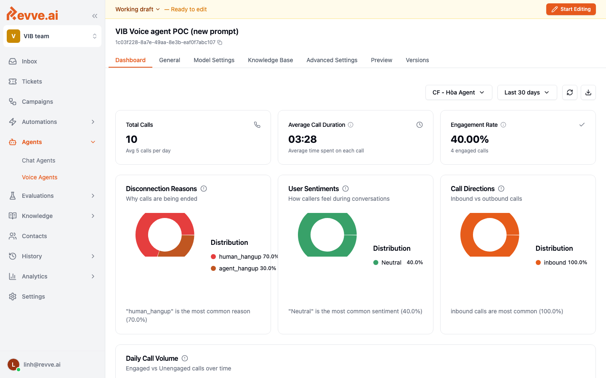

# Agent Dashboard

Every Voice Agent has a **Dashboard** tab that summarizes how the agent is performing right now. It is the first place to look after publishing a new version and the fastest way to spot production issues.

## Headline metrics

Three tiles along the top give you the at-a-glance view:

- **Total Calls** — count in the selected time range.
- **Average Call Duration** — mean call length.
- **Engagement Rate** — share of calls where the caller stayed engaged through the main task.

Pick the time range in the top right: **Last 30 days** is the default; shorter ranges are more useful immediately after a publish.

## Disconnection Reasons

A pie / bar chart of why calls ended. Common values:

| Reason | What it usually means |
|--------|-----------------------|
| `agent_hangup` | Agent ended the call gracefully (expected for a good call). |
| `human_hangup` | Caller ended the call. Small % is normal; a spike means the opening line, prompt, or voice is off. |
| `silence_timeout` | Caller went silent and the agent ended the call after the configured timeout. |
| `voicemail` | Call hit an answering machine. |
| `transfer` | Call was transferred to a human. |
| `error` | Telephony, STT, LLM, or TTS error. Investigate immediately. |

If one reason suddenly dominates after a publish, that is usually your rollback signal.

## User Sentiments

Overall sentiment distribution (positive / neutral / negative). Use it as a lagging indicator of prompt quality:

- **High negative** — usually a prompt tone or interruption issue.
- **Flat neutral** — agent is transactional, which is fine for data-collection flows.
- **Rising positive** — the greeting and voice are landing well.

## Call Directions

Inbound vs outbound split. A Voice Agent that serves both should see both; if one disappears, check number routing in **Advanced Settings → Phone Number**.

## Daily Call Volume

Time series showing daily call counts across the selected window. Use it to spot:

- **Campaign launch spikes** — expected when a new outbound batch starts.
- **Sudden drops** — usually a broken webhook, expired credential, or carrier outage.
- **Weekday / weekend patterns** — helps size capacity.

## Filtering

Use the date range picker and agent selector at the top to scope the dashboard. To drill into individual calls behind any of these numbers, click through to [Call History](./call-history-and-analytics).

## Related

- [Call History and Analytics](./call-history-and-analytics) — call-level detail behind the aggregate numbers.
- [Publishing and Versions](./publishing-and-versions) — when Dashboard numbers shift, roll back here.
