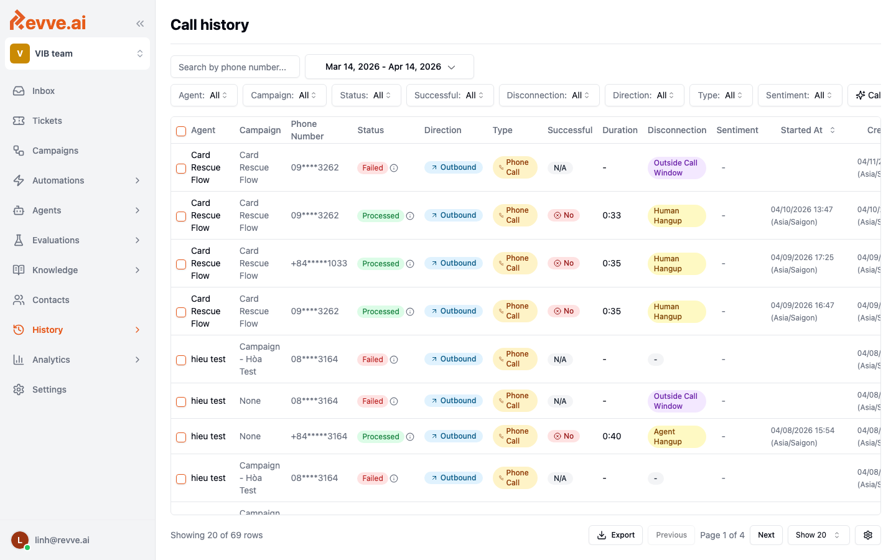

# Call History and Analytics

Every call your Voice Agents take is recorded, transcribed, summarized, and stored. There are two entry points:

- **Call History** (workspace-level) — a searchable table of every call across every agent.
- **Dashboard** (per-agent) — aggregate metrics for a single agent.

## Call History

From the sidebar, click **History**. This opens the Call History table — one row per call, covering every Voice Agent in the workspace.

### Columns

| Column | Meaning |
|--------|---------|
| **Agent** | Which Voice Agent handled the call. |
| **Campaign** | The outbound campaign the call belongs to, if any. |
| **Phone Number** | Caller / callee number (masked for privacy). |
| **Status** | `Processed`, `Failed`, `In Progress`, etc. |
| **Direction** | `Inbound` or `Outbound`. |
| **Type** | `Phone Call` or `Web Call`. |
| **Successful** | Whether the call reached its intended outcome (based on the agent's success criteria). |
| **Duration** | Total call length. |
| **Disconnection** | Reason the call ended (e.g. `human_hangup`, `agent_hangup`, `silence_timeout`, `voicemail`). |
| **Sentiment** | Overall caller sentiment — positive / neutral / negative. |
| **Started At** | Start timestamp. |

### Filters

Use the top bar to filter by date range, agent, campaign, status, direction, disconnection reason, or sentiment. Combine filters to zoom in on specific problems — e.g. "all outbound calls yesterday that ended in `silence_timeout`."

### Call detail

Click a row to open the full call detail. You get:

- **Audio recording** — replay the call.
- **Full transcript** — every turn, timestamped, with STT confidence scores.
- **Call summary** — LLM-generated summary based on your summary prompt.
- **Extracted fields** — structured values captured via the Analysis & Summary schema.
- **Tool calls** — every tool invocation, with arguments and return value.
- **Events timeline** — `call_started`, `transfer`, `voicemail_detected`, `call_ended`, etc.

### Export

Click **Export** to download the filtered call history as CSV. Useful for BI tools and offline QA sampling.

## Per-agent Dashboard

Open any Voice Agent and click the **Dashboard** tab for aggregate metrics scoped to that agent.

### Core metrics

| Metric | Meaning |
|--------|---------|
| **Total Calls** | Total call count in the selected date range. |
| **Average Call Duration** | Mean call length. Short durations on outbound can indicate early hang-ups; long durations can indicate the agent is stuck. |
| **Engagement Rate** | Share of calls where the caller stayed engaged through the main task. |

### Distribution charts

- **Disconnection Reasons** — why calls ended. A spike in `silence_timeout` often means interruption sensitivity or STT is misconfigured. A spike in `human_hangup` early in the call means the greeting or opening line needs work.
- **User Sentiments** — overall emotional tone. Rising negative sentiment after a new version ships is a rollback signal.
- **Call Directions** — inbound vs outbound split.

### Daily Call Volume

A time series of calls per day. Use it to spot volume anomalies (spike from a new campaign, dip from a broken webhook) and to plan capacity.

## Using analytics to drive iteration

A lightweight operational loop after each publish:

1. Publish.
2. Watch the Dashboard for 15–30 minutes — does anything swing?
3. Sample 5–10 calls from Call History, filtered by the newly published agent.
4. Read the transcripts. Note regressions or improvements.
5. If something is off, roll back ([Publishing & Versions](./publishing-and-versions)) and iterate in the draft.

## Related

- [Preview and Testing](./preview-and-testing)
- [Publishing and Versions](./publishing-and-versions)
- [Advanced Settings — Analysis & Summary](./advanced-settings#analysis--summary)
