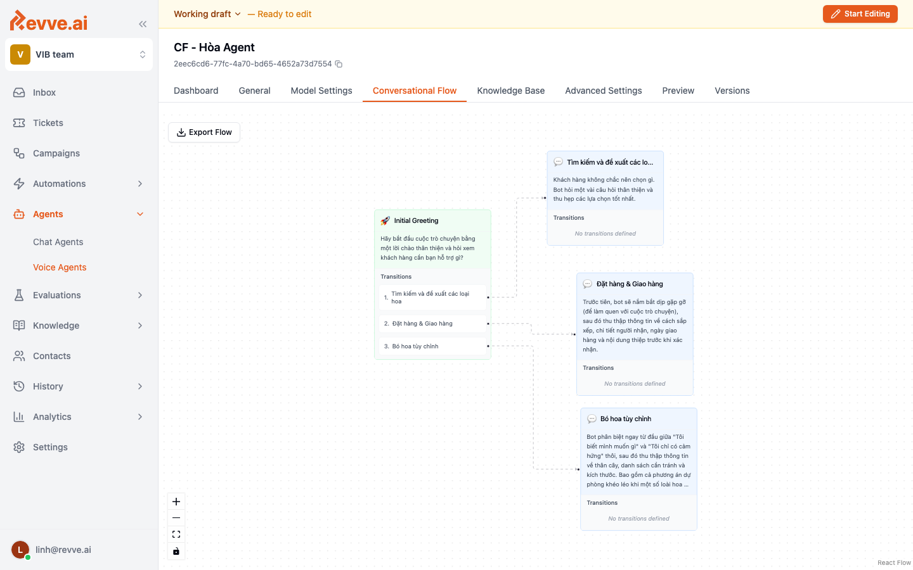

# Conversational Flow

**Conversational Flow** is the second engine type for Voice Agents. Instead of a single Instructions prompt, you design the call as a graph of **nodes** connected by **transitions**. Each node has its own short prompt, its own local rules, and its own exit conditions.

This engine is the right choice when:

- The call has clearly distinct stages (greeting → auth → the actual task → wrap-up).
- Different branches need completely different behavior (a card-lock flow looks nothing like a transaction-dispute flow).
- You need strict compliance over which steps happen in which order.
- You want global handlers like **De-escalation** or **Collect Issue** that can fire from any node.

For free-form or single-purpose agents, use [Simple Prompt](./general-settings) instead.



## Anatomy of a flow

A flow has four kinds of elements:

| Element | Purpose |
|---------|---------|
| **Start / Greeting node** | Where every call begins. Usually contains the opening line and intent detection. |
| **Task nodes** | Stages that do the actual work — authentication, field collection, transactions, FAQ. |
| **Global nodes** | Reachable from any node. Used for de-escalation, collecting issue context, escalating to a human. |
| **End / Goodbye node** | Terminal node. Says farewell and hangs up. |
| **Edges (transitions)** | Directed links between nodes with a condition — keyword, intent, tool result. |

## Designing a flow

A well-designed production flow follows these patterns:

### 1. Keep each node focused

A node should do **one thing**: greet, authenticate, collect a single group of fields, decide an intent. If a node's prompt is longer than ~20 lines, split it.

### 2. Use global nodes for cross-cutting concerns

Define **De-escalation** as a global node for angry customers. Define **Collect Issue** as a global node for "I want to talk to a human." From any task node you can transition into these without duplicating the logic.

### 3. Every task node should have an edge back to Greeting

Customers change topic mid-call. If the agent is in the "Card Lock" node and the caller suddenly says "actually I want to check my balance," the agent must be able to jump back to Greeting to re-route.

### 4. Skip questions when info is already collected

Node instructions should check for already-captured variables and skip questions the caller has already answered. This avoids the "You already told me that" experience.

### 5. Always end with Wrap-up → Goodbye

The Wrap-up node asks "is there anything else?" and reminds the caller of pending items. Goodbye waits for the customer's final farewell before actually ending the call.

## Example: banking hotline

A typical banking voice agent flow:

```
[De-escalation] ◄── (global, angry customer)
      │
      ▼
[Greeting] ──► [Auth] ──► [Card Lock: Identify Reason] ──► [Wrap-up] ──► [Goodbye] ──► End
                    │
                    ├──► [Temp Lock]
                    ├──► [Lost/Stolen]
                    ├──► [Suspicious Txn]
                    └──► [Damaged Card]

[Collect Issue] ◄── (global, reachable from any node)
      │
      ▼
[Transfer to Agent]
```

Every service node has an edge back to `Greeting` for topic switches. `De-escalation` and `Collect Issue` are global, reachable from anywhere.

## Editing the flow

In the editor:

- **Click a node** to edit its prompt, variables, and exit conditions.
- **Drag between node handles** to create an edge. Click the edge to set its condition.
- **Right-click the canvas** to add a new node from the node-type dropdown (Greeting, Task, Global, End).
- **Export Flow** (top-left of the editor) downloads the flow as JSON for version control or sharing.


## Testing a flow

Use the **Preview** tab to walk through the flow via Web Call. The live transcript highlights which node the agent is currently in, which makes it easy to spot misrouted edges or dead ends.

See [Preview and Testing](./preview-and-testing).

## Related

- [General Settings](./general-settings) — the Simple Prompt alternative.
- [Advanced Settings](./advanced-settings) — call-level behavior that applies to every node.
- [Preview and Testing](./preview-and-testing)
