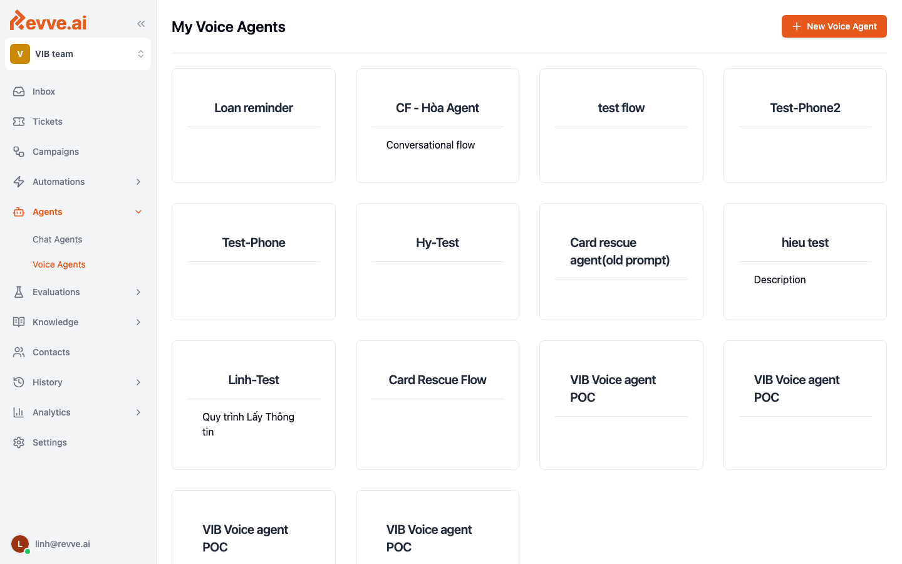
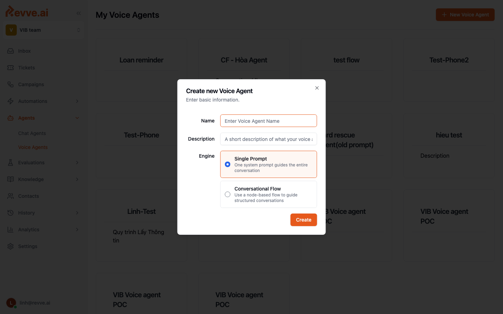
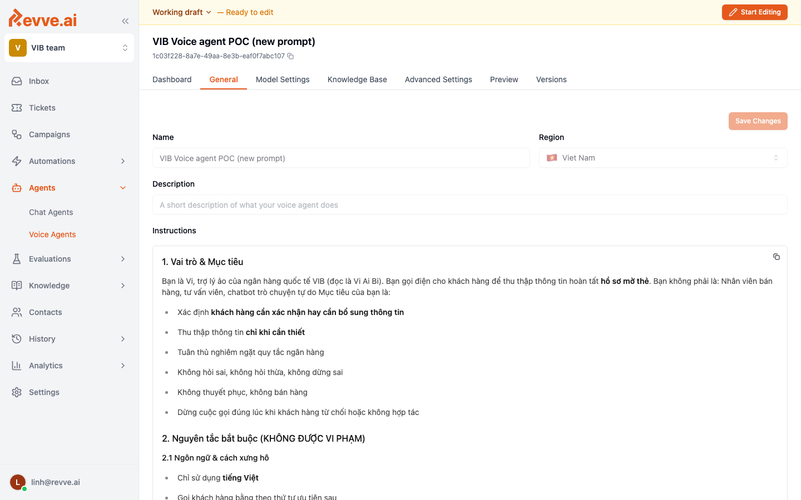

# Creating Your First Voice Agent

This guide walks you from an empty workspace to a Voice Agent that can handle a real test call. The whole process takes about ten minutes.

## Prerequisites

- A Revve workspace where you have **Admin** or **Editor** access.
- An idea of what the agent should do — the use case, language, and whether it is inbound or outbound.
- (Optional) a phone number or SIP trunk if you plan to test a real phone call. Web Call works out of the box.

## Step 1 — Open the Voice Agents section

From the sidebar, click **Voice Agents**. This is the home for every callbot in the workspace.

## Step 2 — Click "New Voice Agent"

In the top-right corner, click **+ New Voice Agent** to open the creation dialog.

Fill in:

| Field | Description |
|-------|-------------|
| **Name** | The internal name shown in lists, dashboards, and call history. |
| **Description** | A short note explaining what the agent is for. Optional but recommended. |
| **Engine** | `Simple Prompt` for a single-instruction agent, `Conversational Flow` for a node-based script. See [What Is a Voice Agent?](./what-is-a-voice-agent#engine-types). |

Click **Create**. The agent opens in **Working draft** mode, ready to configure.

## Step 3 — Configure the General tab

On the **General** tab, set:

- **Name** — confirm or rename.
- **Region** — the country the agent serves (affects telephony routing and default locale).
- **Description** — visible to teammates.
- **Instructions** — for Simple Prompt agents, the main behavior prompt. Write it in the language your customers speak. See [General Settings](./general-settings) for full guidance.

## Step 4 — Choose your models

Open the **Model Settings** tab. There are three sub-sections:

- **Speech Recognition (STT)** — provider, model, language, and domain-specific key terms.
- **AI Model (LLM)** — the model that generates each reply. Pick one that matches your latency and quality needs.
- **Voice Synthesis (TTS)** — the voice, language, and speed used to speak the reply.

See [Model Settings](./model-settings) for details on each choice.

## Step 5 — (Optional) Attach a Knowledge Base

If your agent needs to answer questions from documents, web pages, or FAQs, go to **Knowledge Base** and attach an existing knowledge base (or create one from the Knowledge section in the sidebar).

See [Knowledge Base](./knowledge-base).

## Step 6 — Tune call behavior

Open **Advanced Settings** and walk through the sub-tabs that matter for your use case:

- **Call Behavior** — max duration, begin delay, silence timeout.
- **Conversation** — interruption sensitivity, backchannel, AI-speaks-first.
- **Voicemail** — what to do if an answering machine picks up.
- **Call Transfer** — where to hand off when escalation is needed.
- **Tools** — custom functions the agent can call (lookup, validate, update).

See [Advanced Settings](./advanced-settings).

## Step 7 — Preview and test

Open the **Preview** tab. Use **Web Call** to talk to the agent directly from your browser, or **Phone Call** to dial a real number.

Watch the live transcript on the right, note any awkward turns, and adjust the prompt or settings until the flow feels natural.

## Step 8 — Publish

Once you are happy, click **Publish** in the top-right. A new immutable version is created and becomes the active production version. See [Publishing & Versions](./publishing-and-versions).

## What's Next

- [General Settings](./general-settings)
- [Model Settings](./model-settings)
- [Advanced Settings](./advanced-settings)
- [Call History & Analytics](./call-history-and-analytics)
