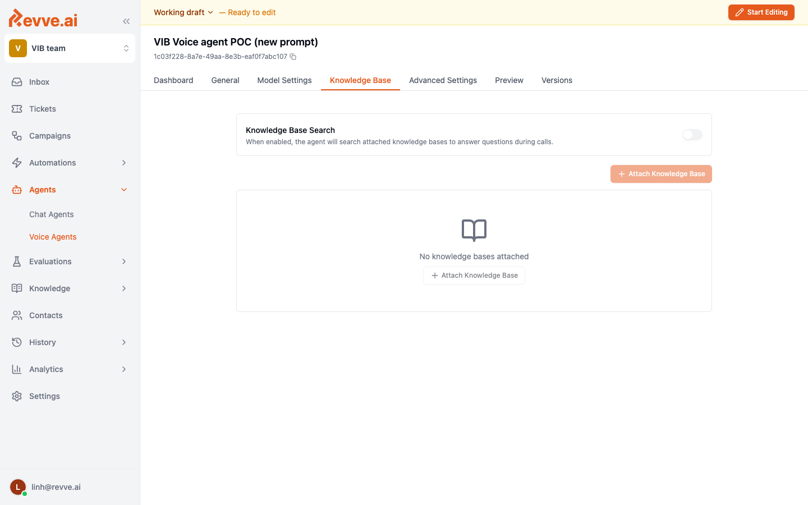

# Knowledge Base

A **Knowledge Base** grounds the agent's replies in your own content — product pages, policy documents, FAQs, crawled web pages. Instead of inventing answers, the agent retrieves the most relevant passages and uses them as context for each reply.

Voice Agents share the same Knowledge Base system as Chat Agents, so any knowledge base you have already built for chat can be reused on the phone.

## When to use a Knowledge Base

- The agent is an **FAQ / support hotline** and needs accurate answers about products, fees, hours, branch locations.
- The agent needs to **quote policy** that changes over time — interest rates, eligibility rules.
- You want the same answers across chat, email, and voice.

## When NOT to use one

- The agent follows a **strict script** (e.g., data collection, verification). Knowledge bases add variance and latency you don't want here.
- All the information the agent needs already fits in the Instructions prompt.

## Attaching a Knowledge Base

1. Open the voice agent and go to the **Knowledge Base** tab.
2. Click **Attach Knowledge Base**.
3. Pick one of the knowledge bases defined in your workspace (sidebar → **Knowledge**).
4. Save and publish.

You can attach different knowledge bases for different categories of question (e.g. one for product FAQs, one for policy) and the agent will retrieve from the right one automatically.

## Building the Knowledge Base

Knowledge bases are created and managed under the **Knowledge** section of the sidebar. They support:

- **Web pages** — scheduled crawls of public or authenticated pages.
- **Documents** — PDF, DOCX, Markdown uploads.
- **FAQs** — manually curated question/answer pairs.

See the Knowledge Base guides in the chat docs — the same pages, crawlers, and FAQs power voice agents too.

## Voice-specific tips

- **Keep passages short.** On voice, the reply has to fit in 2–3 sentences. Long source passages lead to long, robotic replies.
- **Write FAQ answers the way they should be spoken.** Avoid bullet lists and tables — the agent will try to read them aloud.
- **Spell out numbers and abbreviations** the way they should be pronounced. `VIB` → `Vi Ai Bi`.
- **Monitor Knowledge Gaps.** The knowledge-gaps feature highlights questions the agent could not answer well. Use it to prioritize content updates.

## Related

- [General Settings](./general-settings) — Instructions prompt that tells the agent when to quote from the KB.
- [Call History & Analytics](./call-history-and-analytics) — review calls where KB answers were used.
