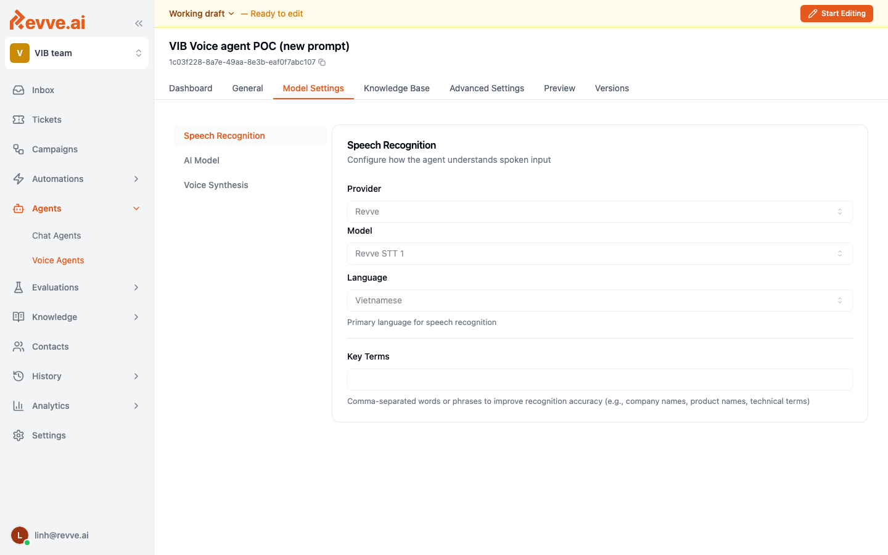
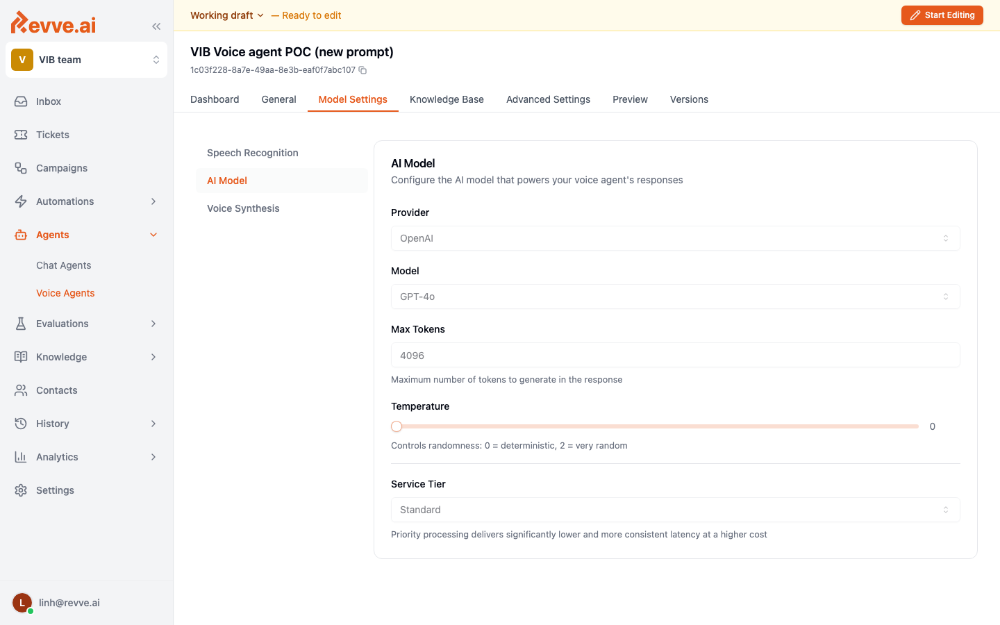
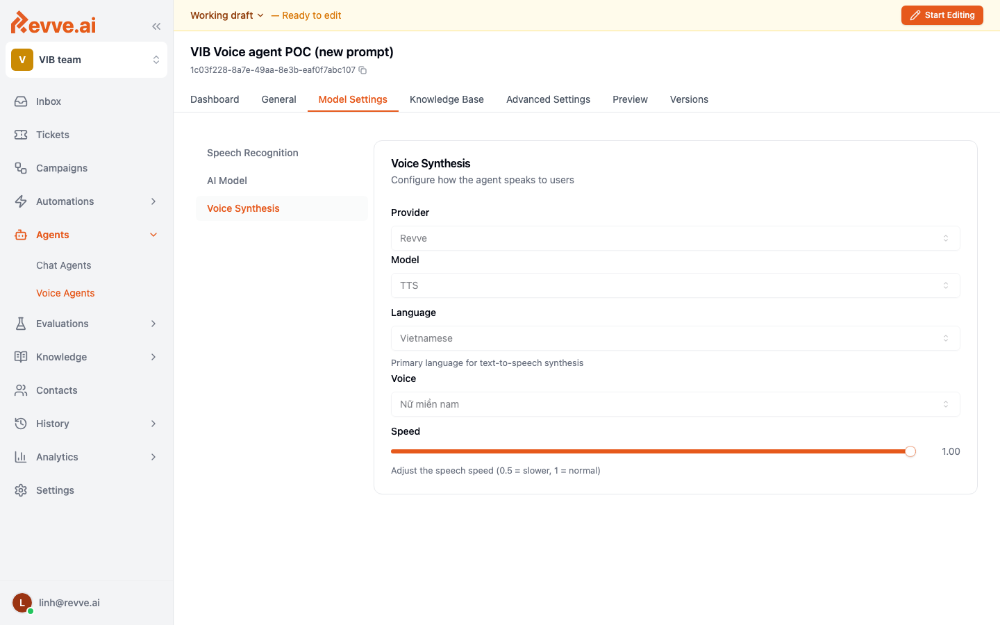

# Model Settings

Every Voice Agent runs on three models working together on every turn of the call:

1. **Speech Recognition (STT)** — converts what the caller says into text.
2. **AI Model (LLM)** — generates the reply.
3. **Voice Synthesis (TTS)** — reads the reply back to the caller.

You configure them on the **Model Settings** tab, which has three sub-sections.

## Speech Recognition

| Field | Purpose |
|-------|---------|
| **Provider** | STT vendor (e.g. Revve, Deepgram). |
| **Model** | Specific STT model from that provider. Newer models trade latency for accuracy. |
| **Language** | Primary language the agent listens for. Must match what your customers actually speak. |
| **Key Terms** | Comma-separated list of domain terms that are often misheard (brand names, product names, technical words). These are biased into the STT decoder to improve accuracy. |

**Tip:** For banking / collections agents, add product names, branch names, and commonly misheard numbers to **Key Terms**. This alone can cut transcription errors by 20–30%.

## AI Model

| Field | Purpose |
|-------|---------|
| **Provider** | LLM vendor (OpenAI, Anthropic, etc.). |
| **Model** | Specific LLM. `gpt-4o` and `claude-sonnet` are the common production choices. Smaller models (`gpt-4o-mini`) are cheaper and faster but less reliable on complex flows. |
| **Max Tokens** | Maximum tokens in a single reply. Keep this small (100–300) for voice — long replies get barged over and feel robotic. |
| **Temperature** | `0` is deterministic, `1` is creative. For scripted calls, use `0.2–0.4`. For free-form support, `0.5–0.7`. |
| **Service Tier** | `Standard` or `Priority`. Priority significantly reduces latency and gives more consistent latency at higher cost. |

**Latency matters on voice.** Every 200 ms the model takes to start streaming is 200 ms of silence the caller has to endure. Prefer the fastest model that hits your quality bar, and enable **Priority** tier for production.

## Voice Synthesis

| Field | Purpose |
|-------|---------|
| **Provider** | TTS vendor (Revve, ElevenLabs, etc.). |
| **Model** | Specific TTS model. |
| **Language** | Output language. Must match the language the LLM is replying in. |
| **Voice** | The specific voice. Pick one that matches the persona: male/female, young/mature, warm/neutral. Listen to samples before committing. |
| **Speed** | Playback speed. `1.0` is normal. For Vietnamese callers we generally use `0.9–1.0`; faster speeds feel rushed, slower speeds feel patronizing. |

**Tip:** Phone numbers and long digits sound more natural when formatted with dashes (`0123-456-789`) before being passed to TTS. Include that instruction in your prompt.

## Putting it together

A common production recipe for a Vietnamese banking voice agent:

| Layer | Choice |
|-------|--------|
| STT | Revve STT 1, language Vietnamese, key terms = product and branch names |
| LLM | `gpt-4o`, temperature `0.3`, max tokens `250`, Priority tier |
| TTS | Revve TTS 1, Vietnamese, female voice, speed `1.0` |

## Related

- [General Settings](./general-settings) — where you write the instructions the LLM follows.
- [Advanced Settings](./advanced-settings) — conversation and interruption tuning.
