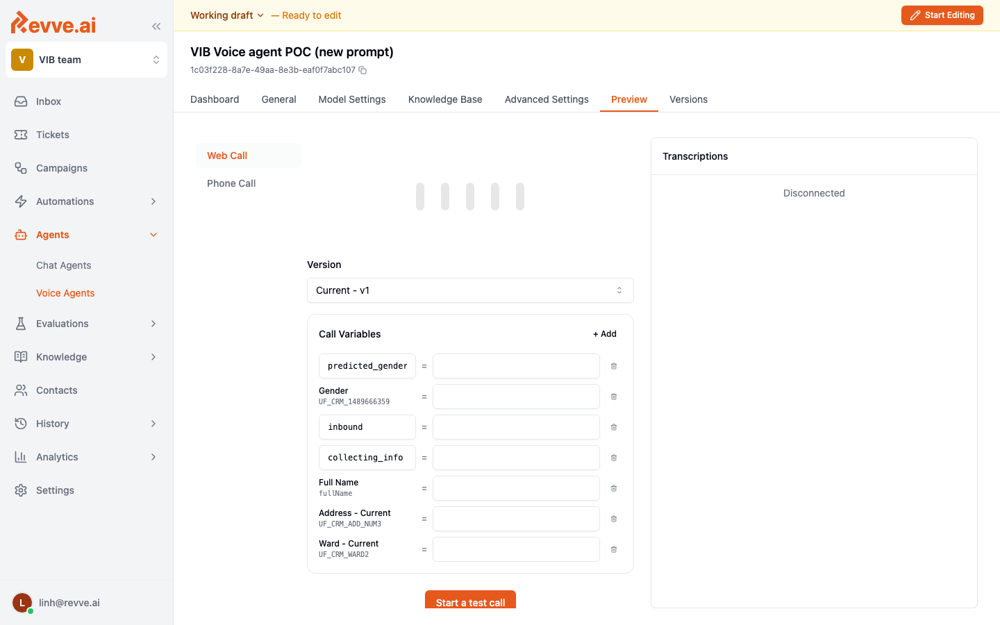

# Preview and Testing

The **Preview** tab lets you talk to a draft voice agent end-to-end before publishing. Two channels are available:

- **Web Call** — in-browser audio session. Fastest way to iterate.
- **Phone Call** — real phone call to any number you provide, using your configured telephony trunk.

## Web Call

The quickest iteration loop. Click **Start a test call**, grant microphone access, and start talking.

The right-hand panel shows a live transcript with the customer's words and the agent's replies. Every turn is timestamped and linked back to the exact prompt used so you can spot exactly where a bad reply came from.

Use Web Call for:

- Prompt iteration (change → reload → call → listen).
- Checking pronunciation / TTS voice quality.
- Walking the whole call path through a Conversational Flow.

Limitations: Web Call does not exercise telephony-specific features like voicemail detection, SIP routing, or real-world STT noise.

## Phone Call

Dials a number you choose and connects the agent to it. Use this for:

- **End-to-end telephony validation** — verify that your trunk, caller ID, and carrier all work.
- **Real-world STT checks** — a mobile call on 3G has very different audio than a browser.
- **Voicemail and transfer testing** — only phone calls can verify these code paths.

## Call Variables

Production calls (from a campaign or API) come with context — contact name, CRM fields, gender, flags like `inbound` or `collecting_info`. On the Preview tab you can seed these **Call Variables** before starting the call, so the agent behaves the same way it would in production.

Common variables to seed during testing:

| Variable | Example |
|----------|---------|
| `fullName` | `Nguyễn Văn A` |
| `phoneNumber` | `0901234567` |
| `predicted_gender` | `male` / `female` |
| `inbound` | `true` / `false` |
| `collecting_info` | `true` if the customer is continuing a previous call |

## Testing checklist

Before publishing a new version, walk through this checklist with Web Call (and at least one Phone Call):

- [ ] **Greeting** sounds natural and finishes cleanly.
- [ ] **Language** — STT transcribes correctly and TTS pronounces brand/product names right.
- [ ] **Happy path** — the most common success flow completes without awkward turns.
- [ ] **Interruption** — barge-in works; the agent yields when you interrupt.
- [ ] **Silence** — if you stay quiet, the follow-up nudge fires, then the call ends cleanly.
- [ ] **Refusal** — "I don't want to" is handled with an objection response, then gracefully ends.
- [ ] **Transfer** — asking for a human triggers the transfer path (or captures context for a callback).
- [ ] **Goodbye** — the farewell feels warm, not robotic, and hangs up on time.

## Iterating

Changes you make to General / Model / Advanced Settings while in **Working draft** mode are live on the next Preview call. You do not need to publish to test.

Only publish once you are satisfied — see [Publishing & Versions](./publishing-and-versions).

## Related

- [Creating Your First Voice Agent](./creating-your-first-voice-agent)
- [Publishing & Versions](./publishing-and-versions)
- [Call History & Analytics](./call-history-and-analytics)
