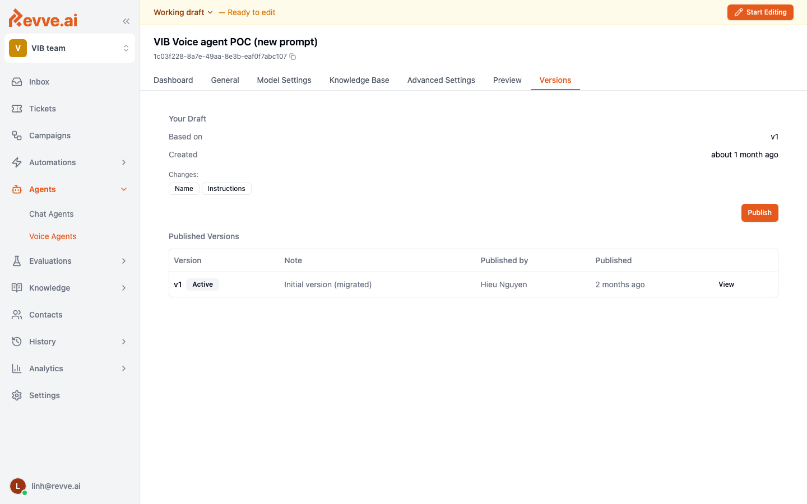

# Publishing and Versions

Every Voice Agent has two modes:

- **Working draft** — editable. All Preview calls use the draft's current state. Not exposed to production traffic.
- **Published versions** — immutable snapshots. Production (phone + API) traffic always hits the **active** published version.

This split means you can safely iterate on a prompt or flow without affecting live calls, then promote the draft to production in a single action.

## Publishing a new version

1. Open the voice agent. The top-right corner shows either **Working draft** or the active version number.
2. Make your changes. The **Publish** button becomes active when the draft differs from the active version.
3. Click **Publish**. Optionally add a **Note** describing what changed (feature name, ticket ID, or plain English).
4. Confirm. A new immutable version is created, incremented (`v2`, `v3`, …), and marked **Active**.

The previous active version is demoted but remains in the history — you can roll back to it at any time.

## Working with the draft

- Click **Start Editing** to unlock the draft. The button toggles to **Save Changes** while edits are pending.
- Every Preview call uses the draft in its current state — you don't need to publish to test.
- If you want to abandon your changes, click **Based on: vN** and reset to a prior version.

## Rollback

If a freshly published version behaves badly on production traffic, roll back immediately:

1. Open the **Versions** tab.
2. Find the known-good version in the history.
3. Click **View** → **Set as Active**.

The switch is instant. In-flight calls finish on the version they started with; new calls start on the newly active version.

## Version notes

Version notes show up in the Versions tab history. Good notes describe *what changed and why*:

- Bad: `update`
- Good: `Added norm_address tool + require address confirmation after norm (ticket VIB-214)`

## Production best practices

- **Publish from a clean draft.** Don't leave half-finished edits in the draft between publishes.
- **Pair publishing with a small Preview test.** Even one web-call through the happy path catches most regressions.
- **Watch Call History for 15 minutes after publish.** See [Call History & Analytics](./call-history-and-analytics). If disconnection reasons or sentiment shift, roll back.
- **Document breaking changes.** If a new version requires new CRM fields or a new webhook, note it in the version note and tell the ops team before publishing.
- **Never edit a tool's contract silently.** Changing the JSON-schema of a tool mid-flight breaks in-progress calls. Publish tool changes during a low-traffic window.

## Related

- [Preview and Testing](./preview-and-testing)
- [Call History & Analytics](./call-history-and-analytics)
